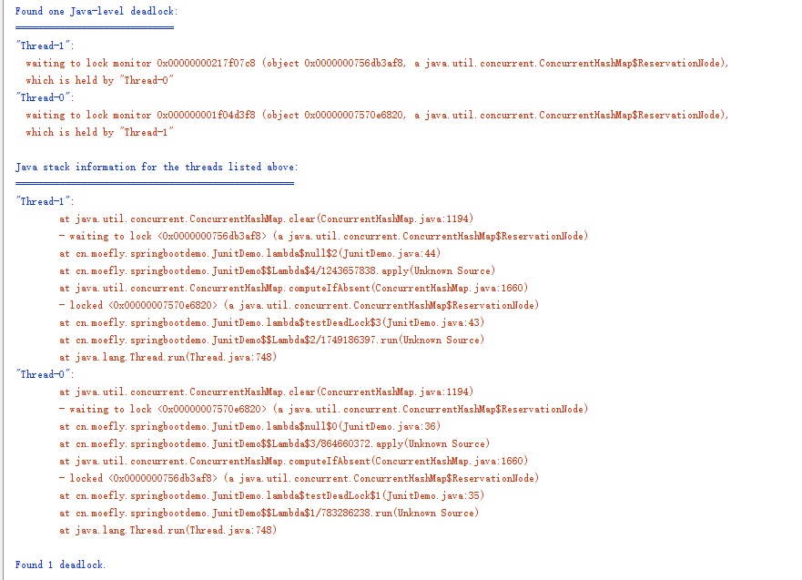
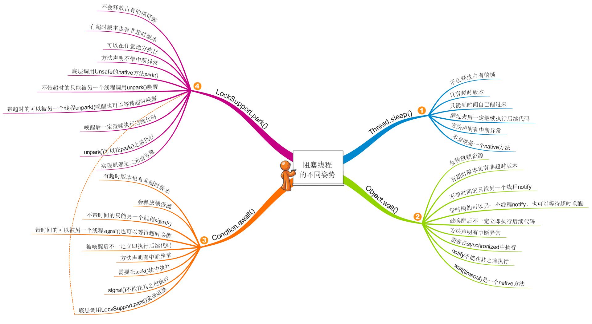
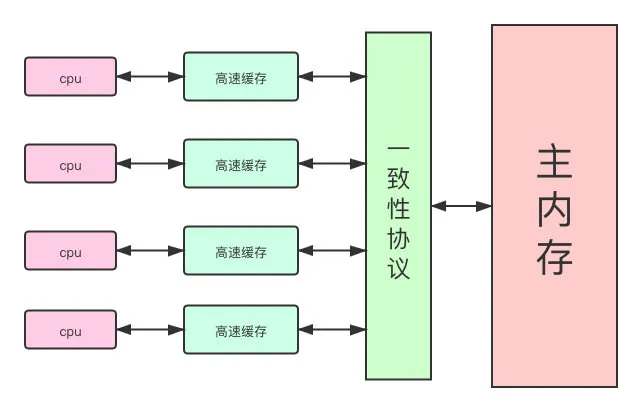
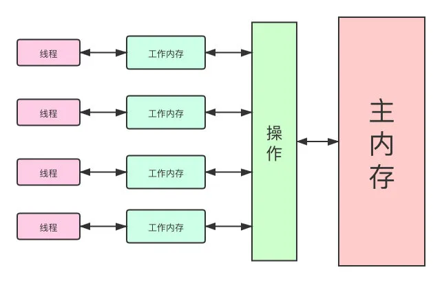
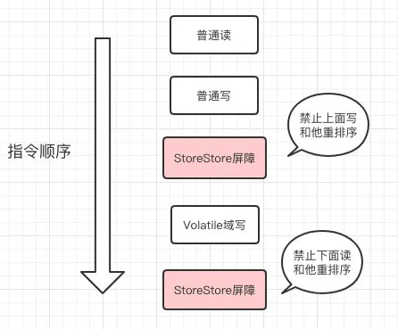
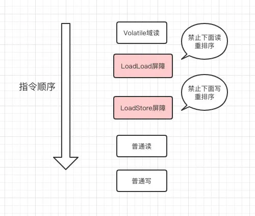

# 《不归路之Java》


> **思想是灵魂，**
>
> **实现是形式。**


## Java 基础


### 基本类型

- 强转

  `long` 转 `int` 注意：最高位为 1 强转会为负数！

  如：正数 2147483648（long 类型）强转 int 会变成负数，`（int）0x80000000 => -2147483648(Integer.MIN_VALUE)`

- 无符号类型

  - java 中无符号类型的解决方案
  - Java8 包装类 新增 无符号运算方法
  - byte 转换 int 时与 0xff 进行与运算的原因

- Integer
  
  [Java Integer(-128~127)值的==和equals比较产生的思考 - CSniper - 博客园 (cnblogs.com)](https://www.cnblogs.com/csniper/p/5882760.html)
  
- 浮点数怎么存储
  
  - [计算机与数学 —— 雷神之锤3源码中的快速逆平方根算法](https://blog.csdn.net/noahzuo/article/details/51555161)


### String

- 正则表达式

- [Java 中的 String 有没有长度限制？](https://www.hollischuang.com/archives/3916)

  - 数组呢？

- StringJoiner（Java 8 中提供的可变字符串类）

- char

  JAVA 的 char 内部编码为 `UTF-16` ，而与 `Charset.defaultCharset()` 无关

- String s = new String("a") 到底产生几个对象？

  对于通过 new 产生一个字符串（"a"）时，会先去常量池中查找是否已经有了”a”对象，如果没有则在常量池中创建一个此字符串对象，然后堆中再创建一个常量池中此"a"对象的拷贝对象。

  也就是说准确答案是产生了一个或两个对象，如果常量池中原来没有"a"，就是两个。反之就是一个。

  是的！如果面试官问到，回答一个或两个即可，但是…毕竟…毕竟

  毕竟我和在座的各位都是人才，Java 知识底蕴不能如此短浅，这题还没谢幕我们还能对面试官多哔哔几句：字符串常量池在不同版本的 jvm 中可能位置不同，那么这又是一个老梗了。（在 JDK6.0 及之前版本，字符串常量池是放在 Perm Gen 区 (也就是方法区) 中；在 JDK7.0 版本，字符串常量池被移到了堆中了）

  扩展：

  1. intern 方法

    - [深入解析 String#intern](https://tech.meituan.com/2014/03/06/in-depth-understanding-string-intern.html)

      关键点是 jdk7 中常量池不在 Perm 区域了，这块做了调整。常量池中不需要再存储一份对象了，可以直接存储堆中的引用

  2. 此外，Java 中的常量池有**字符串常量池**、**class 常量池**和**运行时常量池**。[原文]( http://tangxman.github.io/2015/07/27/the-difference-of-java-string-pool/)

  3. 常量池会被回收吗？


### 枚举

- [枚举详解之 EnumSet、EnumMap 用法](https://www.cnblogs.com/treeshu/p/11013511.html)

  `RegularEnumSet`里面有这样一行代码：

  ```java
  elements = -1L >>> -universe.length;
  ```

  无符号右移一个**负数**！是一个**负移位量**！

  换个例子看一下：`-1 >>> -5` 其实等同 `-1 >>> 27`；`-1L >>> -5` 等同 `-1L >>> 59`

  如果移位量超过位数：`-1 >>> 32` 其实等同 `-1 >>> 0`；`-1 >>> 33` 等同 `-1 >>> 1`


### 数组

- 二维数组按行和按列遍历效率？

  1. CPU 高速缓存
  2. 内存分页调度

  参考：[二维数组按行和按列遍历效率_醒来明月的博客-CSDN 博客_二维数组访问效率](https://blog.csdn.net/lbwo001/article/details/78817439?utm_source=blogxgwz0)


### 运算符

* 左移 右移

  <table>
       <tr>
        <th> 操作符 </th>
        <th> 描述 </th>
        <th> 例子 </th>
     </tr>
     <tr>
        <td><< </td>
        <td> 按位左移运算符。左操作数按位左移右操作数指定的位数。</td>
        <td>A << 2 得到 240，即 1111 0000</td>
     </tr>
     <tr>
        <td>>> </td>
        <td> 按位右移运算符。左操作数按位右移右操作数指定的位数。</td>
        <td>A >> 2 得到 15 即 1111</td>
     </tr>
     <tr>
        <td>>>> </td>
        <td> 按位右移补零操作符。左操作数的值按右操作数指定的位数右移，移动得到的空位以零填充。</td>
        <td>A>>>2 得到 15 即 0000 1111</td>
     </tr>
  </table>

* 优先级

  运算符优先级，左右优先级


### 日期与时间

Date 和 Calendar，LocalDateTime（Java8），ZonedDateTime（时区），Instant

* LocalDate/LocalTime 类

  Java 8 新增了 `LocalDate` 和 `LocalTime` 接口，为什么要搞一套全新的处理日期和时间的 API？因为旧的 `java.util.Date` 实在是太难用了：

  `java.util.Date` 月份从`0`开始，一月是 `0`，十二月是 `11`，变态吧！`java.time.LocalDate` 月份和星期都改成了 `enum`，就不可能再用错了。

  `java.util.Date` 和 `SimpleDateFormatter` 都不是线程安全的，而 `LocalDate` 和 `LocalTime` 和最基本的 `String` 一样，是不变类型，不但线程安全，而且不能修改。

* Instant

  `Instant` 获取的是 **UTC** 的时间，而 `Date` 是根据当前服务器所处的环境的默认时区来获取的当前时间。


### 泛型

擦拭，extends 通配符，super 通配符

问题：

为什么泛型编译期擦除了，getGenericSuperclass 或反射等还能获取得到？

[Java 泛型类型擦除与运行时类型获取 - linghu_java - 博客园 (cnblogs.com)](https://www.cnblogs.com/linghu-java/p/11865108.html)


### 异常

- Error 和 Exception 的区别

- finally语句到底是在return之前还是之后执行？
  1. 不管有木有出现异常，finally块中代码都会执行；
  2. 当try和catch中有return时，finally仍然会执行；
  3. finally是在return语句执行之后，返回之前执行的（此时并没有返回运算后的值，而是先把要返回的值保存起来，不管finally中的代码怎么样，返回的值都不会改变，仍然是之前保存的值），所以函数返回值是在finally执行前就已经确定了；
  4. finally中如果包含return，那么程序将在这里返回，而不是try或catch中的return返回，返回值就不是try或catch中保存的返回值了。


### 位运算

- `^`“异或运算”的特殊作用：

  （1）使特定位翻转找一个数，对应 X 要翻转的各位，该数的对应位为 1，其余位为零，此数与 X 对应位异或即可。

  例：X=10101110，使 X 低 4 位翻转，用 X ^ 0000 1111 = 1010 0001 即可得到。

  （2）与 0 相异或，保留原值 ，X ^ 0000 0000 = 1010 1110。

- `~`取反:

  注意最高位也会取反


### Math

* log

  在 Java 中求 log2N，首先要弄明白一个初中学到的公式 `log2N=logeN/loge2` ，logeN 代表以 e 为底的 N 的对数，loge2 代表以 e 为底的 2 的对数

  在 java.lang.math 类中的 log(double a) 代表以 e 为底的 a 的对数，因此 log2N 在 Java 中的表示为 `log((double)N)/log((double)2)`

* pow


## Java 高级


### 数据结构

- 位集合（BitSet）

  JDK 中的 BitSet 集合对是**布隆过滤器**中经常使用的数据结构**Bitmap**的相对简单的实现。BitSet 采用了**Bitmap 的算法思想**。

- 向量（Vector）

  线程安全

- 栈（Stack）

- 字典（Dictionary）

- 哈希表（Hashtable）

- 属性（Properties）


### 集合容器

#### HashMap

> Java 集合比如说 HashMap 和 ConcurrentHashMap 我觉得，最好在平时能去耐心读一下源码，搜一搜相关的博客，最好能知道每个参数为什么设置成这么大？有什么好处？为什么？

* hash 算法

  [详细梳理 JAVA7 和 JAVA8 HashMap 的 hash 实现](https://blog.csdn.net/u013453787/article/details/84702992)

* 优化

  最近它有两个主要的更新——一个在 Java 7u40 版本中对于空 map 的共享的底层存储，以及在 Java 8 中将底层 hash bucket 链接成为**哈希树**（改进更差情况下的性能）。

  * jdk1.7 中的线程安全问题

    **resize 死循环：**

    - [ConcurrentModificationException](https://www.2cto.com/kf/201403/286536.html)
    - [疫苗：JAVA HASHMAP 的死循环](https://coolshell.cn/articles/9606.html)

    jdk8 中是如何解决 jdk7 中的 HashMap 死循环的


##### IdentityHashMap

和 HashMap 最大的不同，就是使用==而不是 equals 比较 key


##### WeakHashMap

会内存泄漏？


##### ConcurrentSkipListMap

**跳表** [ConcurrentSkipListMap](https://blog.csdn.net/sunxianghuang/article/details/52221913)


#### ConcurrentHashMap

- 死循环

  [ConcurrentHashMap BUG 死锁](https://blog.csdn.net/zhanglong_4444/article/details/93638844)

- 死锁（该问题由 fly 提出并收录）

  ```java
  ConcurrentHashMap<Integer, Integer> map = new ConcurrentHashMap<>();
  map.put(1, 1);
  map.put(2, 2);
  Thread t1 = new Thread(() -> {
      LockSupport.parkNanos(TimeUnit.SECONDS.toNanos(2));
      map.computeIfAbsent(4, key -> {
          map.clear();
          System.out.println("4");
          return key;
      });
  });
  Thread t2 = new Thread(() -> {
      LockSupport.parkNanos(TimeUnit.SECONDS.toNanos(2));
      map.computeIfAbsent(3, key -> {
          map.clear();
          System.out.println("3");
          return key;
      });
  });
  t1.start();
  t2.start();
  t1.join();
  t2.join();
  System.out.println("finish");
  ```

  ConcurrentHashMap 1194 行会死锁

  


#### TreeMap

TreeSet 同理，红黑树实现


#### List

* CopyOnWriteArrayList

  附：Redis 写快照的时候，用到了 Linux 底层的 Copy-On-Write 技术

* 一个著名 BUG

  c.toArray might (incorrectly) not return Object[] (see 6260652) [原文](https://blog.csdn.net/qq_33589510/article/details/104767849)

  `java.util.ArrayList` 元素类型为`Object[] elementData`，`toArray()`方法实质返回`Object[]`

  `java.util.Arrays.ArrayList` 元素类型为`E[] a`，`toArray()`方法实质返回`E[]`

  因此，虽然`List`的`toArray`接口表面都返回 Object[]，但他们的实质返回值还是有差的。所以我们不能将其他类型的对象，放进`java.util.Arrays.ArrayList#toArray()`返回的数组中。

  ```java
  List<String> list = Arrays.asList("abc");
  // class java.util.Arrays$ArrayList
  System.out.println(list.getClass());
  
  Object[] objArray = list.toArray();
  // class [Ljava.lang.String;
  System.out.println(objArray.getClass());
  
  // cause ArrayStoreException
  objArray[0] = new Object();
  ```


#### Queue

* 接口的几个主要方法

  add/offer, remove/poll, element/peek

* DelayQueue

  ScheduledThreadPoolExecutor 其任务队列默认是 DelayedWorkQueue 的变种


#### Arrays

- 几个类

  TimSort，ComparableTimSort，DualPivotQuicksort

- 几个方法

  binarySort 折半插入排序

  mergeSort


#### Koloboke

（第三方的集合库）

原始类型集合库**Koloboke**，避免大量的装箱拆箱，Koloboke 的目标是替换标准的 Java 集合和流的 API，提供更高效的实现。

同类型的还有 HPPC，Eclipse Collections 等。


#### 线程安全的类

另看：[并发容器](#并发容器)


#### fail-fast 和 fail-safe

[快速失败(fail-fast)和安全失败(fail-safe)的区别 - 那啥快看 - 博客园 (cnblogs.com)](https://www.cnblogs.com/shamo89/p/6685216.html)


### 代理

- 按照代理的创建时期，代理类可以分为两种。

  > 静态代理：由程序员创建或特定工具自动生成源代码，再对其编译。在程序运行前，代理类的.class 文件就已经存在了。
  >
  > 动态代理：在程序运行时，运用反射机制动态创建而成。

- 动态代理方案

  - jdk 动态代理

  - cglib 动态代理

    JDK 的动态代理机制只能代理实现了接口的类，而不能实现接口的类就不能实现 JDK 的动态代理，cglib 是针对类来实现代理的，他的原理是对指定的目标类生成一个子类，并覆盖其中方法实现增强，但因为采用的是继承，所以不能对 final 修饰的类进行代理。

    [Cglib 与 JDK 动态代理](https://my.oschina.net/xiaolyuh/blog/3108376)

  - javassist 动态代理

  - ASM 字节码

  - javassist 字节码

- [深入理解 RPC 之动态代理篇 - 徐靖峰|个人博客 (cnkirito.moe)](https://www.cnkirito.moe/rpc-dynamic-proxy/)

- Q&A

  为什么 cglib 为什么生成两个 fastclass，`methodProxy.invokeSuper(“代理对象”, args)` 和 `methodProxy.invoke(“原对象”, args)` 虽然底层分别调用两个不同的 fastclass，但结果是一样的。

  ```java
  // 自定义 Cglib 代理拦截
  public class DemoInterceptor implements MethodInterceptor {
      // @param o           cglib 生成的代理对象
      // @param method      被代理对象方法
      // @param objects     方法入参
      // @param methodProxy 代理方法
      public Object intercept(Object o, Method method, Object[] objects, MethodProxy methodProxy) throws Throwable {
          System.err.println("intercept");
          // invokeSuper，o 为 cglib 生成的代理对象
          return methodProxy.invokeSuper(o, objects);
      }
  }
  ```

  ```java
  // org.springframework.aop.framework.CglibAopProxy.CglibMethodInvocation    
  private static class CglibMethodInvocation extends ReflectiveMethodInvocation {
      private final MethodProxy methodProxy;
      private boolean protectedMethod;
      public CglibMethodInvocation(Object proxy, Object target, Method method, Object[] arguments, Class<?> targetClass, List<Object> interceptorsAndDynamicMethodMatchers, MethodProxy methodProxy) {
          super(proxy, target, method, arguments, targetClass, interceptorsAndDynamicMethodMatchers);
          this.methodProxy = methodProxy;
          this.protectedMethod = Modifier.isProtected(method.getModifiers());
      }
      protected Object invokeJoinpoint() throws Throwable {
          // invoke，target 为原对象
          return this.protectedMethod ? super.invokeJoinpoint() : this.methodProxy.invoke(this.target, this.arguments);
      }
  }
  ```

  可扩展看看 `Spring` 的 `JdkDynamicAopProxy`，其实本质上 Spring 对代理的处理都差不多


### 反射

#### Class

- Class类 与 Class 对象

  Class 没有公共构造方法。Class 对象是在加载类时由 Java 虚拟机以及通过调用类加载器中的 defineClass 方法自动构造的，因此不能显式地声明一个Class对象。 

  虚拟机为每种类型管理一个独一无二的Class对象。也就是说，每个类（型）都有一个Class对象。运行程序时，Java虚拟机(JVM)首先检查是否所要加载的类对应的Class对象是否已经加载。如果没有加载，JVM就会根据类名查找.class文件，并将其Class对象载入。

  基本的 Java 类型（boolean、byte、char、short、int、long、float 和 double）和关键字 void 也都对应一个 Class 对象。 

  每个数组属于被映射为 Class 对象的一个类，所有具有相同元素类型和维数的数组都共享该 Class 对象。

- Class 对象的获取方式

  1. Class.forName("类名字符串")
  2. 类名.class
  3. 实例对象.getClass()
  
- 关键字 instanceof **VS** Class.isInstance（参数）

  ```java
  System.err.println(son instanceof Parent);
  System.err.println(Parent.class.isInstance(son));
  ```

- Class 的 getSuperclass 与 getGenericSuperclass

  **getGenericSuperclass 会包含该超类的泛型。**

- 判断当前类是什么类

  ```java
  boolean isLocalClass(); //判断是不是局部类，也就是方法里面的类，其实现：isLocalOrAnonymousClass() && !isAnonymousClass();
  boolean isLocalOrAnonymousClass();
  boolean isMemberClass(); //判断是不是成员内部类，也就是一个类里面定义的类
  boolean isAnonymousClass(); //判断当前类是不是匿名类，一般为实例化的接口或实例化的抽象类
  boolean isAnnotation();// 判断 Class 对象是否是注解类型
  boolean isPrimitive(); // 判断 Class 是否为原始类型（int，double 等）
  boolean isSynthetic(); // 判断是否由 Java 编译器生成（除了像默认构造函数这一类的）的方法或者类，Method 也有这个方法
  ```

  参考：

  [Java 中冷门的 synthetic 关键字原理解读 - 老白讲互联网 - 博客园 (cnblogs.com)](https://www.cnblogs.com/bethunebtj/p/7761596.html)

- 返回字符串 (String) 的方法

  ```java
  String getCanonicalName(); //返回 Java Language Specification 中所定义的底层类的规范化名称
  String getName(); //以 String 的形式返回此 Class 对象所表示的实体（类、接口、数组类、基本类型或 void）名称（全限定名：包名.类名）。
  String getSimpleName(); //返回源代码中给出的底层类的简称。
  String toString(); //将对象转换为字符串。
  ```

- Class.forName 和 ClassLoader 的区别

  都可用来对类进行加载。

  不同：

  1）Class.forName() 除了将类的.class 文件加载到 jvm 中之外，**还会对类进行解释，执行类中的 static 块，还会执行给静态变量赋值的静态方法**

  2）classLoader 只干一件事情，就是将.class 文件加载到 jvm 中，不会执行 static 中的内容,只有在 newInstance 才会去执行 static 块。

* 使用 Class.getResource 和 ClassLoader.getResource 方法获取文件路径

  对于**class.getResource(path)**方法，其中的参数 path 有两种形式，一种是以“/”开头的，另一种是不以"/"开头

  **Class.getClassLoader().getResource(String path)**，该方法中的参数 path 不能以“/“开头，path 表示的是从 classpath 下获取资源的


#### Method

- **Method**.invoke() 的实现原理

  [假笨说-从一起 GC 血案谈到反射原理](https://mp.weixin.qq.com/s/5H6UHcP6kvR2X5hTj_SBjA)

  **获取 Method：**

    - reflectionData，这个属性主要是 SoftReference 的
    - 我们每次通过调用 `getDeclaredMethod` 方法返回的 Method 对象其实都是一个**新的对象**，所以不宜多调哦，如果调用频繁最好缓存起来。不过这个新的方法对象都有个 root 属性指向 `reflectionData` 里缓存的某个方法，同时其 `methodAccessor` 也是用的缓存里的那个 Method 的 `methodAccessor`。

  **Method 调用：**

    - 其实 `Method.invoke` 方法就是调用 `methodAccessor` 的 `invoke` 方法

  **MethodAccessor 的实现：**

    - 所有的方法反射都是先走 `NativeMethodAccessorImpl`，默认调了**15**次之后，才生成一个 `GeneratedMethodAccessorXXX` 类
    - 而 `GeneratedMethodAccessorXXX` 的类加载器会 `new`  一个 `DelegatingClassLoader(var4)`，之所以搞一个新的类加载器，是为了性能考虑，在某些情况下可以卸载这些生成的类，因为**类的卸载是只有在类加载器可以被回收的情况下才会被回收的**

  **并发导致垃圾类创建：**

    - 假如有 1000 个线程都进入到创建 `GeneratedMethodAccessorXXX` 的逻辑里，那意味着多创建了 999 个无用的类，这些类会一直占着内存，**直到能回收 Perm 的 GC 发生才会回收**（关于元空间的回收看[JVM内存管理](#内存管理)）

      后来发现JDK17加了个乐观锁判断 `U.compareAndSetInt(this, GENERATED_OFFSET, 0, 1)`，应该是修复过这个问题了（但JDK8并没有修复）

  **其他 JVM 相关文章:**

    - 该文章最后有其他 JVM 相关文章，感觉是干货

- [反射代理类加载器的潜在内存使用问题](https://www.jianshu.com/p/20b7ab284c0a)！！

  大量的类加载器 `sun/reflect/DelegatingClassLoader`，用来加载 `sun/reflect/GeneratedMethodAccessor` 类，可能导致潜在的占用大量本机内存空间问题，应用服务器进程占用的内存会显著增大。

- 其他链接

  [JDK1.8里Method.invoke()的实现原理 - 简书 (jianshu.com)](https://www.jianshu.com/p/3b311109050b)


#### MethodHandle

反射获取的信息比 MethodHandle 要多。

反射是模拟 java 代码层面的调用，MethodHandle 是模拟字节码层面的调用。

`MethodHandle` 和 反射 相比好处是：

- 调用 invoke() 已经被 JVM 优化，类似直接调用一样。
- 性能好得多，类似标准的方法调用。
- 当我们创建 MethodHandle 对象时，实现方法检测，而不是调用 invoke() 时。

看 [指令集](#指令集)


#### VarHandle

VarHandle主要用于**动态操作数组的元素或对象的成员变量**。VarHandle与MethodHandle非常类似，它也需要通过MethodHandles来获取实例。


### 创建和销毁对象

#### 单例 与 序列化

一般来说，一个类实现了 Serializable 接口，我们就可以把它往内存地写再从内存里读出而"组装"成一个跟原来一模一样的对象。不过当序列化遇到单例时，这里边就有了个问题：从内存读出而组装的对象破坏了单例的规则。单例是要求一个 JVM 中只有一个类对象的，而现在通过反序列化，一个新的对象克隆了出来。

解决方案：加上 readResolve() 方法

```java
public final class MySingleton implements Serializable {
    private MySingleton() {
    }
    private static final MySingleton INSTANCE = new MySingleton();
    public static MySingleton getInstance() {
        return INSTANCE;
    }

    private Object readResolve() throws ObjectStreamException {
        // instead of the object we're on,
        // return the class variable INSTANCE
        return INSTANCE;
    }
}
```


#### 对象实例化顺序

1. 父类的静态成员变量和静态代码块加载
2. 子类的静态成员变量和静态代码块加载
3. 父类成员变量和方法块加载
4. 父类的构造函数加载
5. 子类成员变量和方法块加载
6. 子类的构造函数加载

参考：

- [Java 类的实例化顺序](https://www.cnblogs.com/yanghe123/p/10936025.html)
- [java 类实例化顺序+经典的面试题](https://blog.csdn.net/qq_36382679/article/details/105811529)

测试：com.ariescat.metis.base.jdk.TestSameField


#### java 中父类与子类有相同属性调谁？

**继承中：**

属性：不可被重写，只会被隐藏

方法：会被重写，不会隐藏

**多态中，**

成员变量无论编译和运行，都参考左边 (**引用型变量所属的类**)。

也就是说

```java
Fu f = new Zi();System.out.println(f.age);
```

打印的还是父类的值。

参考：

- [java 中父类与子类有相同属性调谁？取决于左边](https://blog.csdn.net/qq_40093255/article/details/108400976)

- [父类和子类同时存在相同属性 BeanUtils 的 copyProperties 复制](https://blog.csdn.net/u012786993/article/details/82923064/)


### 对象引用

- [WeakReference](https://www.jianshu.com/p/964fbc30151a)

  看 ThreadLocal 源码的时候，其中嵌套类 ThreadLocalMap 中的 Entry 继承了 WeakReference，为了能搞清楚 ThreadLocal，只能先了解下了 WeakReference：

  > WeakReference 如字面意思，弱引用， 当**一个对象**仅仅被 WeakReference（弱引用）指向, 而没有任何其他 strong reference（强引用）指向的时候, 如果这时 GC 运行, 那么**这个对象**就会被回收，不论当前的内存空间是否足够，这个对象都会被回收。
  >
  > 注意：回收的是 WeakReference 引用的对象！若存在 ReferenceQueue 队列，WeakReference 本身会入队，但此时 get()==null

  - [WeakHashMap](https://blog.csdn.net/u012420654/article/details/51793909)

  - SoftReference 若清楚了上面的原理，[SoftReference](https://www.jianshu.com/p/8c634f10ed1a) 只是**生命周期**变成**内存将要被耗尽的时候**。

    > - from [关于 SoftReference 被回收的时机](https://blog.csdn.net/S7188290/article/details/86436479)
    >
    > 下面，我们来总结一下:
    > 1.当发生 GC 时，虚拟机可能会回收 SoftReference 对象所指向的软引用，是否被回收取决于该软引用是否是新创建或近期使用过。
    > 2.在虚拟机抛出 OutOfMemoryError 之前，所有软引用对象都会被回收。
    > 3.只要一个软引用对象由一个强引用指向，那么即使是 OutOfMemoryError 时，也不会被回收。
    >
    > - from [JVM - 优化案例（SoftRefLRUPolicyMSPerMB）](https://blog.csdn.net/qiang_zi_/article/details/100700784)
    >
    > 那么 SoftReference 对象到底在 GC 的时候要不要回收是通过什么公式来判断的呢？
    >
    > 是如下的一个公式：
    >
    > clock - timestamp <= freespace * SoftRefLRUPolicyMSPerMB
    >
    > 这个公式的意思就是说，“clock - timestamp”代表了一个软引用对象他有多久没被访问过了，freespace 代表 JVM 中的空闲内存空间，SoftRefLRUPolicyMSPerMB 代表每一 MB 空闲内存空间可以允许 SoftReference 对象存活多久。

  - guava cache：

    ```java
    CacheBuilder.newBuilder().softValues().build()
    ```

    当然 softValues() 可以替换成 weakKeys() / weakValues() ...

    实现原理可具体看 com.google.common.cache.LocalCache.Strength

  - LRU 缓存实现 (Java)

- 软引用和弱引用

  被软引用关联的对象只有在内存不足时才会被回收，而被弱引用关联的对象在JVM进行垃圾回收时总会被回收。针对上面的特性，软引用适合用来进行缓存，当内存不够时能让JVM回收内存，弱引用能用来在回调函数中防止内存泄露。因为回调函数往往是匿名内部类，隐式保存有对外部类的引用，所以如果回调函数是在另一个线程里面被回调，而这时如果需要回收外部类，那么就会内存泄露，因为匿名内部类保存有对外部类的强引用。


### 对象序列化

- Serializable

- readResolve() 与 单例

- ObjectInputStream、ObjectOutputStream

  看看readObject与writeObject方法源码


### 对象拷贝

- 深复制（深克隆）和浅复制（浅克隆）

- [BeanUtils 对象属性 copy 的性能对比以及源码分析](https://www.cnblogs.com/kancy/p/12089126.html)

  <table>
     <tr>
        <th> 拷贝方式 </th>
        <th> 对象数量: 1</th>
        <th> 对象数量: 1000</th>
        <th> 对象数量: 100000</th>
        <th> 对象数量: 1000000</th>
     </tr>
     <tr>
        <td>Hard Code</td>
        <td>0 ms</td>
        <td>1 ms</td>
        <td>18 ms</td>
        <td>43 ms</td>
     </tr>
     <tr>
        <td>cglib.BeanCopier</td>
        <td>111 ms</td>
        <td>117 ms</td>
        <td>107 ms</td>
        <td>110 ms</td>
     </tr>
     <tr>
        <td>spring.BeanUtils</td>
        <td>116 ms</td>
        <td>137 ms</td>
        <td>246 ms</td>
        <td>895 ms</td>
     </tr>
     <tr>
        <td>apache.PropertyUtils</td>
        <td>167 ms</td>
        <td>212 ms</td>
        <td>601 ms</td>
        <td>7869 ms</td>
     </tr>
     <tr>
        <td>apache.BeanUtils</td>
        <td>167 ms</td>
        <td>275 ms</td>
        <td>1732 ms</td>
        <td>12380 ms</td>
     </tr>
  </table>


### 热更新

- 自定义类加载器

  - [探秘 Java 热部署](https://www.jianshu.com/p/731bc8293365)
  - [CSDN·自定义 classloader 实现 JAVA 热替换](https://blog.csdn.net/puhaiyang/article/details/78165465)

- java.lang.instrument

  类重新定义，这是 Instrumentation 提供的基础功能之一，这个类很早就出了，redefineClasses 这个方法可以更新方法级别的代码，但是不会触发一个类的初始化方法。

  - [游戏服务器之 Java 热更新](https://www.cnblogs.com/wgslucky/p/9127681.html)
  - [动态加载 class 文件](https://zheng12tian.iteye.com/blog/1495037)
  - [JVM 源码分析之 javaagent 原理完全解读](https://www.imooc.com/article/42736)
  - [探秘 Java 热部署二（Java agent premain）](https://www.jianshu.com/p/0bbd79661080)
  - [探秘 Java 热部署三（Java agent agentmain）](https://www.jianshu.com/p/6096bfe19e41)

- 第三方工具

  - [**Arthas**的使用](https://www.cnblogs.com/orange911/p/10583245.html)
  - [Github · **HotswapAgent**](https://github.com/HotswapProjects/HotswapAgent)

- 脚本语言

  - groovy

    使用 groovy 类加载器重载 java 代码 重载的 java 文件可以直接使用源文件，无需编译为 class


### JVMTI

JVM Tool Interface，是jvm暴露出来的一些供用户扩展的接口集合，JVMTI是基于事件驱动的，JVM每执行到一定的逻辑就会调用一些事件的回调接口（如果有的话），这些接口可以供开发者去扩展自己的逻辑。

#### JVMTIAgent

JVMTIAgent其实就是一个动态库，利用JVMTI暴露出来的一些接口来干一些我们想做但是正常情况下又做不到的事情，不过为了和普通的动态库进行区分，它一般会实现如下的一个或者多个函数：

```c++
JNIEXPORT jint JNICALL
Agent_OnLoad(JavaVM *vm, char *options, void *reserved);

JNIEXPORT jint JNICALL
Agent_OnAttach(JavaVM* vm, char* options, void* reserved);

JNIEXPORT void JNICALL
Agent_OnUnload(JavaVM *vm); 
```

JVM启动参数：-agentlib:libname[=options]、-agentpath:pathname[=options]。

比如：-agentlib:hprof，会搜到环境变量PATH中的dll/so库；而-agentpath会按全路径装载本地库，不再搜索PATH中的路径，其他功能和agentlib相同。


#### javaagent

`javaagent`是由一个叫做`instrument`的`JVMTIAgent`（linux下对应的动态库是`libinstrument.so`）来实现的，另外`instrument agent`还有个别名叫`JPLISAgent`（Java Programming Language Instrumentation Services Agent），从这名字里也完全体现了其最本质的功能：就是专门为java语言编写的插桩服务提供支持的。

JVM启动参数：-javaagent:jarpath[=options]

参考：[java agent基础原理_ancinsdn的博客](https://blog.csdn.net/ancinsdn/article/details/58276945)


### System#exit

1. 注册的关闭勾子会在以下几种时机被调用到

- 程序正常退出
  - 最后一个非守护线程执行完毕退出时
  - System.exit 方法被调用时
- 程序响应外部事件
  - 程序响应用户输入事件，例如在控制台按 ctrl+c(^+c)
  - 程序响应系统事件，如用户注销、系统关机等

2. 这种方法永远不会正常返回。

   意味着该方法不会返回；一旦一个线程进入那里，就不会再回来了。

链接：

- [Java System#exit 无法退出程序的问题探索](https://blog.csdn.net/qq271859852/article/details/106596524)

- [java System.exit(0) 结束不了其他线程?](https://bbs.csdn.net/topics/392009252)

  最后一楼说了：将 A 线程变为 while(true) 一直执行，就会发现 A 线程也会中止。两个线程各自执行，之前都循环十次，A 线程可能在 B 线程调用 System.exit(0) 之前就执行完了


### ServiceLoader

Java 中 SPI 全称为（Service Provider Interface，服务提供者接口）

该类通过在资源目录 META-INF/services 中放置**提供者配置文件**来标识**服务提供者**。

应用场景：

1. JDBC 驱动加载

   `java.sql.DriverManager#loadInitialDrivers`这里调用了`ServiceLoader.load(Driver.class);`

   因此只要 pom 引入了`mysql-connector-java`这个包，就会加载`jar`包下`META-INF/services/java.sql.Driver`文件中的`com.mysql.jdbc.Driver`类，而`com.mysql.jdbc.Driver`在静态代码块里往`DriverManager`注册了自己的驱动。所以以后就不用写下面的 a 段代码啦。

   ```java
   //a.导入驱动，加载具体的驱动类
   Class.forName("com.mysql.jdbc.Driver");
   //b.与数据库建立连接
   connection = DriverManager.getConnection(URL, USERNAME, PASSWORD);
   ```

2. netty/Java 的 NIO 采用 SelectorProvider 创建：`io.netty.channel.nio.NioEventLoop#provider`

   而`java.nio.channels.spi.SelectorProvider#provider`采用了 SPI

3. Dubbo 的扩展点加载

   Dubbo 的 SPI 扩展是自己实现的，在启动加载的时候会依次从以下目录中读取配置文件：

   META-INF/dubbo/internal/、META-INF/dubbo/、META-INF/services/

   ——《高可用可伸缩微服务架构：基于 Dubbo、Spring Cloud 和 Service Mesh》3.2.3 节 Dubbo Extension 机制


### Observable

操作 Vector 型变量 obs 的四个方法都加有同步关键字，Vector 类型为线程安全的，而上述四个方法为什么还要加同步关键字呢？


### Java 注解处理器

Annotation Processor

javax.annotation.processing.AbstractProcessor 编译时执行


### JMX

JMX 是 Java Management Extensions，它是一个 Java 平台的管理和监控接口。

了解不深==


### 启动

- jsvc

  > 在 linux 上以服务的方式启动 java 程序，需要提前安装 jsvc。linux 是利用 daemon(jsvc) 构建 java 守护进程。


### 语法糖

有认真了解过 Java 的语法糖吗？

- [Java 中的 10 颗语法糖](https://www.cnblogs.com/duanxz/p/3916028.html)


### 字符编解码

- 字符集

  1. ASCII

  2. Unicode

     目前 Unicode 字符分为 17 组编排，0x0000 至 0x10FFFF,每组称为平面（Plane）,每个面拥有 65536 个码位，共 1114112 个。

- 字符编码

  UTF-32、UTF-16 和 UTF-8 是 Unicode 标准的编码字符集的字符编码方案

  - 附：

    1. Java 的`char`内部编码为`UTF-16`，而与`Charset.defaultCharset()`无关。

       看 [Unicode 编码理解](https://blog.csdn.net/wdeng2011/article/details/80155795) 可知`UTF-16`编码完全可以满足 Unicode 的 17 组编排（平面），因为有平面 0 的 0xD800-0xDFFF 代理区。

       [关于 java 中 char 占几个字节，汉字占几个字节](https://www.cnblogs.com/nevermorewang/p/7808092.html)，这里指出 Java 中的`char`是占用两个字节，只不过有些字符需要两个 char 来表示，同时这篇博客也给了一个官方 Oracle 链接里面明确的说明了*值在 16 位范围之外且在 0x10000 到 0x10FFFF 范围内的字符称为补充字符，并定义为**一对 char 值***。

       测试代码：

       ```java
       public static void main(String[] args) {
       
           char[] c = new char[]{'一'};
           System.err.println(Integer.toHexString(c[0]));
           String s = new String(c);
           // String#length事实上调用了char[].length
           System.err.println(s + " " + s.length());
       
           String str = "一";
           System.err.println(str + " " + str.length());
       
           // Unicode编码 汉字扩展B '𠀀' 字
           c = new char[]{'\uD840', '\uDC00'};
           s = new String(c);
           System.err.println(s + " " + s.length());
       
           str = "\uD840\uDC00";
           System.err.println(str + " " + str.length());
       
           // 输出：由输出可见这个字用了两个char来存
           // 一 1
           // 一 1
           // 𠀀 2
           // 𠀀 2
       }
       ```

    2. [UniCode 编码表](https://www.cnblogs.com/csguo/p/7401874.html)

    3. [汉字 unicode 编码范围](https://blog.csdn.net/gywtzh0889/article/details/71083459/)

  - 参考博客：

    1. 吴秦（Tyler）[字符集和字符编码（Charset & Encoding）](https://www.cnblogs.com/skynet/archive/2011/05/03/2035105.html)

    2. 廖雪峰 [字符串和编码](https://www.liaoxuefeng.com/wiki/1016959663602400/1017075323632896)

       该文有简单有效的解释了：

       在计算机内存中，统一使用 Unicode 编码，当需要保存到硬盘或者需要传输的时候，就转换为 UTF-8 编码。
       用记事本编辑的时候，从文件读取的 UTF-8 字符被转换为 Unicode 字符到内存里，编辑完成后，保存的时候再把 Unicode 转换为 UTF-8 保存到文件：

       

       浏览网页的时候，服务器会把动态生成的 Unicode 内容转换为 UTF-8 再传输到浏览器：

       

       所以你看到很多网页的源码上会有类似`<meta charset="UTF-8" />`的信息，表示该网页正是用的 UTF-8 编码。

- Base64 编码：

  Base64 编码本质上是一种将二进制数据转成文本数据的方案。对于非二进制数据，是先将其转换成二进制形式，然后每连续 6 比特（2 的 6 次方=64）计算其十进制值，根据该值在上面的索引表中找到对应的字符，最终得到一个文本字符串。

- 常见问题处理之 Emoji

  所谓 Emoji 就是一种在 Unicode 位于\u1F601–\u1F64F 区段的字符。这个显然超过了目前常用的 UTF-8 字符集的编码范围\u0000–\uFFFF。Emoji 表情随着 IOS 的普及和微信的支持越来越常见。

  

  那么 Emoji 字符表情会对我们平时的开发运维带来什么影响呢？最常见的问题就在于将他存入 MySQL 数据库的时候。一般来说 MySQL 数据库的默认字符集都会配置成 UTF-8，mysql 支持的 utf8 编码最大字符长度为 **3 字节**，而 utf8mb4 在 5.5 以后才被支持，也很少会有 DBA 主动将系统默认字符集改成 utf8mb4。那么问题就来了，当我们把一个需要 4 字节 UTF-8 编码才能表示的字符存入数据库的时候就会报错：ERROR 1366: Incorrect string value: '\xF0\x9D\x8C\x86' for column 。 如果认真阅读了上面的解释，那么这个报错也就不难看懂了。我们试图将一串 Bytes 插入到一列中，而这串 Bytes 的第一个字节是\xF0 意味着这是一个四字节的 UTF-8 编码。但是当 MySQL 表和列字符集配置为 UTF-8 的时候是无法存储这样的字符的，所以报了错。

  那么遇到这种情况我们如何解决呢？有两种方式：升级 MySQL 到 5.6 或更高版本，并且将表字符集切换至 utf8mb4。第二种方法就是在把内容存入到数据库之前做一次过滤，将 Emoji 字符替换成一段特殊的文字编码，然后再存入数据库中。之后从数据库获取或者前端展示时再将这段特殊文字编码转换成 Emoji 显示。第二种方法我们假设用-*-1F601-*-来替代 4 字节的 Emoji，那么具体实现 python 代码可以参见[Stackoverflow 上的回答](http://stackoverflow.com/questions/3220031/how-to-filter-or-replace-unicode-characters-that-would-take-more-than-3-bytes)


### 补码

补码(为什么按位取反再加一)：告诉你一个其实很简单的问题 [原文](https://blog.csdn.net/wenxinwukui234/article/details/42119265)

其核心思想就是：**一个正数对应的负数（也就是俩相反数），这两个数的二进制编码加起来必须等于 0 才对**


### 设计模式

#### 六大设计原则

单一职责原则(Single Responsibility Principle - SRP)

开放封闭原则(Open Closed Principle - OCP)

里氏替换原则(Liskov Substitution Principle - LSP)

最少知识原则(Least Knowledge Principle - LKP)

接口隔离原则(Interface Segregation Principle - ISP)

依赖倒置原则(Dependence Inversion Principle - DIP)


#### 设计模式

- 单例
  - double check
  - volatile 禁止new的指令重排

参考：

[Java开发中的23种设计模式详解(转) - maowang - 博客园 (cnblogs.com)](https://www.cnblogs.com/maowang1991/archive/2013/04/15/3023236.html)


#### 反模式

上帝类(God Class)，这个类里面控制了很多其他的类，同时也依赖其他很多类。整个类不光负责自己的主要单一功能，而且还负责了其他很多功能，包括一些辅助功能。


### Swing/Awt

- EventQueue 与 AWTEvent

  > from https://github.com/jzyong/game-server.git
  >
  > game-tool/src/main/java/com/jzy/game/tool/db/DBTool.java
  >
  > `java.awt.EventQueue.invokeLater`

  `EventQueue`里有一条`dispatchThread`线程，在`postEventPrivate`里检测为 null 则进行初始化，然后一直调用`pumpEvents`取出优先级最高的`AWTEvent`进行分发：

  `eq.dispatchEvent(event);`

  如`java.awt.Component#dispatchEventImpl`里会触发各种监听

- [Polygon](https://segmentfault.com/a/1190000007736473)，区域超区校验


## Java IO

### IO 流

1. 对文件进行操作：FileInputStream（字节输入流），FileOutputStream（字节输出流），FileReader（字符输入流），FileWriter（字符输出流）

   2020 年 3 月 17 日追加：

  2. `FileReader`，可以理解成他把 `FileInputStream` 和 `Decoder` 封装了起来，本质上还是用 FileInputStream 读了一层字节流 byte[] (这里的 read 是一个 `native` 方法)，然后通过 Decoder 把他转成了 char[]。

  3. `BufferedReader`，他默认开辟了一份 `defaultCharBufferSize = 8192` 长度的 cb[] 数组（缓冲区），读之前会把这个数组`fill()`满，之后都是操作这个数组，操作完了就再次更新数组，提高数据访问的效率。

   测试代码：`study-metis: com.ariescat.metis.base.io.iostream.Test`

2. 对管道进行操作：PipedInputStream（字节输入流），PipedOutStream（字节输出流），PipedReader（字符输入流），PipedWriter（字符输出流）

   PipedInputStream 的一个实例要和 PipedOutputStream 的一个实例共同使用，共同完成管道的读取写入操作，主要用于**线程操作**。

   有空看看这里的实现 [简介,源码分析和示例](https://www.cnblogs.com/skywang12345/p/io_04.html)

   在一个线程里使用 PipedInputStream 和 PipedOutputStream 会造成死锁：这意味着，如果你用同一个线程既读又写（read() 和 write() 方法是阻塞的方法），那么就会造成这个线程的死锁。

3. 字节/字符数组：ByteArrayInputStream，ByteArrayOutputStream，CharArrayReader，CharArrayWriter

   在内存中开辟了一个字节或字符数组。

4. Buffered 缓冲流：BufferedInputStream，BufferedOutputStream，BufferedReader，BufferedWriter

   带缓冲区的处理流，缓冲区的作用的主要目的是：避免每次和硬盘打交道，提高数据访问的效率。

5. 转化流：

   InputStreamReader：在读入数据的时候将字节转换成字符。

   OutputStreamWriter：在写出数据的时候将字符转换成字节。

6. 数据流：DataInputStream，DataOutputStream

   因为平时若是我们输出一个 8 个字节的 long 类型或 4 个字节的 float 类型，那怎么办呢？可以一个字节一个字节输出，也可以把转换成字符串输出，但是这样转换费时间，若是直接输出该多好啊，因此这个数据流就解决了我们输出数据类型的困难。数据流可以直接输出 float 类型或 long 类型，提高了数据读写的效率。

7. 打印流：printStream，printWriter

   一般是打印到控制台，可以进行控制打印的地方和格式，其中的  print 方法不会抛出异常，可以通过 checkError 方法来查看异常。

8. 对象流：ObjectInputStream，ObjectOutputStream

   把封装的对象直接输出，而不是一个个在转换成字符串再输出。

9. `RandomAccessFile` 随机访问文件

   java.io 包中是一个特殊的类, 既可以读文件，也可以写文件。

   **有空也要看看这里的实现**，log4j2 的 Appender 里就有这个：`RandomAccessFileAppender`、`RollingRandomAccessFileAppender`

   RandomAccessFile 的绝大多数功能，但不是全部，已经被 JDK 1.4 的 nio 的内存映射文件**(memory-mapped files)**给取代了，你该考虑一下是不是用"内存映射文件"来代替 RandomAccessFile 了。

10. ZipInputStream、ZipOutputStream

    读取 zip 文档 getNextEntry、putNextEntry 得到或创建 ZipEntry 对象。


### close()

为什么要用 `close()` 关掉流？

有些资源 `GC` 回收不掉？


### Path/Files

- [IO 操作你还在用 File 吗，该拥抱 Path 和 Files 了](https://www.sohu.com/a/132459571_654433)


### NIO

- Channel，Buffer，Selector
- [高性能 IO 之 Reactor 模式](https://www.cnblogs.com/doit8791/p/7461479.html)


## Java 并发


### 概述

JUC 包，毫无疑问的，得去学，哪怕平时编程根本不去用，但是得会，至少得知道有这个东西，至少得知道 aba，cas，aqs，unsafe，volatile，sync，常见的各种 lock，死锁，线程池参数和如何合理的去设置，必须明白自旋，阻塞，死锁和它如何去定位，oom 如何定位问题，cpu 过高如何定位等基本的操作。你可以没有生产调试经验，但不代表你可以不会 top，jps，jstack，jmap 这些可能会问的东西。


### 线程

#### 线程创建

有三种使用线程的方法：

- 实现 Runnable 接口；
- 实现 Callable 接口；
- 继承 Thread 类。

链接：[Java 并发的四种风味](https://blog.csdn.net/yonlist/article/details/84736424)


#### 线程状态

`java.lang.Thread.State`，里面的注释内容讲解得很清楚了

链接：

1. [Java 线程的 6 种状态及切换 (透彻讲解)](https://blog.csdn.net/pange1991/article/details/53860651)
2. [Java 中一个线程只有六个状态。至于阻塞、可运行、挂起状态都是人们为了便于理解，自己加上去的](https://www.cnblogs.com/GooPolaris/p/8079490.html)


#### 基础机制

* sleep

* yield

  静态方法 Thread.yield() ，切换给其它线程来执行。该方法只是对线程调度器的一个建议，而且也只是建议具有相同优先级的其它线程可以运行。

* 守护线程

  守护线程是指为其他线程服务的线程。在 JVM 中，所有非守护线程都执行完毕后，无论有没有守护线程，虚拟机都会自动退出。因此，JVM 退出时，不必关心守护线程是否已结束。


#### 线程之间协作



* join

  在线程中调用另一个线程的 join() 方法，会将当前线程挂起，而不是忙等待，直到目标线程结束。

* wait() notify() notifyAll()

  调用 wait() 使得线程等待某个条件满足，线程在等待时会被挂起，当其他线程的运行使得这个条件满足时，其它线程会调用 notify() 或者 notifyAll() 来唤醒挂起的线程。

  它们都属于 Object 的一部分，而不属于 Thread。

  **wait() 和 sleep() 的区别**

  - wait() 是 Object 的方法，而 sleep() 是 Thread 的静态方法；

  - **wait() 会释放锁，sleep() 不会。**

    当使用调用 wait 时，虽然当前的线程还在 schronized 同步块中， 但是也会让出锁，要不然，notify 永远拿不到锁，永远得不到执行。

    同样当使用完 notify 后，是不会立即释放锁的，必须使你当前线程走完 schronized 的代码，也就是说只有当前线程走完 schronized 代码块之后，wait 才会被执行。
    
    可以看下这个：[13 案例分析：多线程锁的优化.md (lianglianglee.com)](http://learn.lianglianglee.com/专栏/Java 性能优化实战-完/13  案例分析：多线程锁的优化.md) 里面的 synchronied 小节

* await() signal() signalAll()

  java.util.concurrent 类库中提供了 **Condition 类**来实现线程之间的协调，可以在 Condition 上调用 await() 方法使线程等待，其它线程调用 signal() 或 signalAll() 方法唤醒等待的线程。

  相比于 wait() 这种等待方式，await() 可以指定等待的条件，因此更加灵活。

  `ReentrantLock` 就用了 Condition 类。

  他们释放锁吗？这里其实没这个说法，想想是不是这样~

* LockSupport.park（ReentrantLock）

  [白话讲懂 wait notify 和 park unpark 的使用示例和区别_pengweismile 的专栏-CSDN 博客](https://blog.csdn.net/pengweismile/article/details/108836666)

  [面试 LockSupport.park() 会释放锁资源吗？](http://www.imooc.com/article/294581)


#### 中断线程

* InterruptedException

  - 何时抛出？

  - java.util.concurrent.ThreadPoolExecutor#shutdown

    看看 interruptWorkers，interruptIdleWorkers

* interrupted 和 isInterrupted 区别


### 同步互斥

#### synchronized

- Java 对象

  在 JVM 中**，对象在内存中的布局分为三块区域：对象头、实例数据和对齐填充。**

  1. **对象头：Java 对象头一般占有 2 个机器码（在 32 位虚拟机中，1 个机器码等于 4 字节，也就是 32bit，在 64 位虚拟机中，1 个机器码是 8 个字节，也就是 64bit），但是 如果对象是数组类型，则需要 3 个机器码，因为 JVM 虚拟机可以通过 Java 对象的元数据信息确定 Java 对象的大小，但是无法从数组的元数据来确认数组的大小，所以用一块来记录数组长度。**
  2. 实例数据：存放类的属性数据信息，包括父类的属性信息。
  3. 对齐填充：由于虚拟机要求 对象起始地址必须是 8 字节的整数倍。填充数据不是必须存在的，仅仅是为了字节对齐。

- 对象头

  - Mark Work
  - 指向类的指针
  - 数组长度

- Mark Work

  <table>
     <tr>
        <td rowspan="2"> 锁状态 </td>
        <td colspan = "2">25bit</td>
        <td rowspan="2">4bit</td>
        <td>1bit</td>
        <td>2bit</td>
     </tr>
     <tr>
        <td>23bit</td>
        <td>2bit</td>
        <td> 是否偏向锁 </td>
        <td> 锁标志位 </td>
     </tr>
     <tr>
        <td> 无锁 </td>
        <td colspan = "2"> 对象的 HashCode</td>
        <td> 分代年龄 </td>
        <td>0</td>
        <td>01</td>
     </tr>
     <tr>
        <td> 偏向锁 </td>
        <td> 线程 ID</td>
        <td>Epoch</td>
        <td> 分代年龄 </td>
        <td>1</td>
        <td>01</td>
     </tr>
     <tr>
        <td> 轻量级锁 </td>
        <td colspan = "4"> 指向栈中锁记录的指针 </td>
        <td>00</td>
     </tr>
     <tr>
        <td> 重量级锁 </td>
        <td colspan = "4"> 指向重量级锁的指针 </td>
        <td>10</td>
     </tr>
     <tr>
        <td>GC 标记 </td>
        <td colspan = "4"> 空 </td>
        <td>11</td>
     </tr>
  </table>

- 原理

  [死磕 Synchronized 底层实现](https://mp.weixin.qq.com/s/2ka1cDTRyjsAGk_-ii4ngw)

  * 保证了原子性、可见性、有序性

  * 可重入、不可中断

  * 同步代码

    所有的互斥，其实是获取 monitor 的所有权。

    - 当我们进入一个人方法的时候，执行 **monitorenter**，就会获取当前对象的一个所有权，这个时候 monitor 进入数为 1，当前的这个线程就是这个 monitor 的 owner。
    - 如果你已经是这个 monitor 的 owner 了，你再次进入，就会把进入数+1.
    - 同理，当他执行完 **monitorexit**，对应的进入数就-1，直到为 0，才可以被其他线程持有。

  * 同步方法

    **ACC_SYNCHRONIZED** 标志位

    同步方法的时候，一旦执行到这个方法，就会先判断是否有标志位，然后，ACC_SYNCHRONIZED 会去隐式调用刚才的两个指令：monitorenter 和 monitorexit。

    所以归根究底，还是 monitor 对象的争夺。

- Monitor 对象

  Monitor 其实是一种同步工具，也可以说是一种同步机制，它通常被描述为一个对象。

  主要特点：

  - 对象的所有方法都被“互斥”的执行
  - 通常提供 singal 机制

  “ Java 对象是天生的 Monitor。”

  [关于Monitor对象在sychronized实现中的应用_super_x_man的博客-CSDN博客_monitor撖寡情](https://blog.csdn.net/super_x_man/article/details/81741073)

- 用户态和内核态的转换

  过程是很复杂的，也涉及很多值的传递；synchronized 在 1.6 之前之所以说重量级，有部分原因在这，大量的系统资源消耗。

- 偏向锁与 hashcode 能共存吗

  [偏向锁与 hashcode 能共存吗？_Saintyyu 的博客-CSDN 博客](https://blog.csdn.net/Saintyyu/article/details/108295657)


#### 锁优化

这里的锁优化主要是指 JVM 对 synchronized 的优化。

* 自旋锁、锁消除、锁粗化

* 偏向锁、轻量级锁、重量级锁

  [彻底搞懂 synchronized(从偏向锁到重量级锁)](https://blog.csdn.net/qq_38462278/article/details/81976428)

<table>
   <tr>
      <th> 锁 </th>
      <th> 优点 </th>
      <th> 缺点 </th>
      <th> 适用场景 </th>
   </tr>
   <tr>
      <td> 偏向锁 </td>
      <td> 加锁和解锁不需要额外的消耗，和执行非同步方法比仅存在纳秒级的差距。</td>
      <td> 如果线程间存在锁竞争，会带来额外的锁撤销的消耗。</td>
      <td> 适用于只有一个线程访问同步块场景。</td>
   </tr>
   <tr>
      <td> 轻量级锁 </td>
      <td> 竞争的线程不会阻塞，提高了程序的响应速度。</td>
      <td> 如果始终得不到锁竞争的线程使用自旋会消耗 CPU。</td>
      <td> 追求响应时间。同步块执行速度非常快。</td>
   </tr>
   <tr>
      <td> 重量级锁 </td>
      <td> 线程竞争不使用自旋，不会消耗 CPU。</td>
      <td> 线程阻塞，响应时间缓慢。</td>
      <td> 追求吞吐量。同步块执行速度较长。</td>
   </tr>
</table>


#### volatile

* 可见性

* 重排序（编译器重排，处理器重排）

  happen-before 原则：[深入理解 happens-before 规则](https://www.jianshu.com/p/9464bf340234)


#### 内存模型

对 volatile 的进一步补充，jvm 的内存模型。

* 并发三大特性

  原子性，可见性，有序性

* 现代计算机内存模型

  处理器与内存的速度矛盾，加入了一层读写速度尽可能接近处理器运算速度的 `高速缓存（Cache）`，但它引入了一个新的问题：`缓存一致性（CacheCoherence）`。

  在多处理器系统中，每个处理器都有自己的高速缓存，而它们又共享同一主内存（MainMemory）。

  

* JMM

  `Java 内存模型 (JavaMemoryModel)` 描述了 Java 程序中各种变量（线程共享变量）的访问规则，以及在 JVM 中将变量，存储到内存和从内存中读取变量这样的底层细节。

  **JMM 有以下规定：**

  > 所有的共享变量都存储于主内存，这里所说的变量指的是实例变量和类变量，不包含局部变量，因为局部变量是线程私有的，因此不存在竞争问题。
  >
  > 每一个线程还存在自己的工作内存，线程的工作内存，保留了被线程使用的变量的工作副本。
  >
  > `线程对变量的所有的操作 (读，取) 都必须在工作内存中完成，而不能直接读写主内存中的变量`。
  >
  > 不同线程之间也不能直接访问对方工作内存中的变量，线程间变量的值的传递需要通过主内存中转来完成。

  

  **正是因为这样的机制，才导致了可见性问题的存在**

* 主要有三种实现可见性的方式：

  - volatile

    每个线程操作数据的时候会把数据从主内存读取到自己的工作内存，如果他操作了数据并且写会了，他其他已经读取的线程的变量副本就会失效了，需要都数据进行操作又要再次去主内存中读取了。

    volatile 保证不同线程对共享变量操作的可见性，也就是说一个线程修改了 volatile 修饰的变量，当修改写回主内存时，另外一个线程立即看到最新的值。

  - synchronized

    某一个线程进入 synchronized 代码块前后，线程会获得锁，清空工作内存，从主内存拷贝共享变量最新的值到工作内存成为副本，执行代码，将修改后的副本的值刷新回主内存中，线程释放锁。

  - final

    被 final 关键字修饰的字段在构造器中一旦初始化完成，并且没有发生 this 逃逸（其它线程通过 this 引用访问到初始化了一半的对象），那么其它线程就能看见 final 字段的值。

* 缓存一致性协议

  别看加一个 volatile 关键字很简单，但实际上他在背后含辛茹苦默默付出了不少，了解下计算机层面的缓存一致性协议。

  当多个处理器的运算任务都涉及同一块主内存区域时，将可能导致各自的缓存数据不一致，那同步回到主内存时以谁的缓存数据为准呢？

  为了解决一致性的问题，需要各个处理器访问缓存时都遵循一些协议，在读写时要根据协议来进行操作，这类协议有 MSI、`MESI（IllinoisProtocol）`、MOSI、Synapse、Firefly 及 DragonProtocol 等。

  * MESI

    Intel 的 MESI

    嗅探

* 重排序

  为了提高性能，**编译器**和**处理器**常常会对既定的代码执行顺序进行指令重排序。

  

  一般重排序可以分为如下三种：

  - 编译器优化的重排序。编译器在不改变单线程程序语义的前提下，可以重新安排语句的执行顺序;
  - 指令级并行的重排序。现代处理器采用了指令级并行技术来将多条指令重叠执行。如果不存在数据依赖性，处理器可以改变语句对应机器指令的执行顺序;
  - 内存系统的重排序。由于处理器使用缓存和读/写缓冲区，这使得加载和存储操作看上去可能是在乱序执行的。

* as-if-serial

  不管怎么重排序，单线程下的执行结果不能被改变。

  编译器、runtime 和处理器都必须遵守 as-if-serial 语义。

* Volatile 是怎么保证不会被执行重排序?

  **内存屏障**

  为了实现 volatile 的内存语义，JMM 会限制特定类型的编译器和处理器重排序，JMM 会针对编译器制定 volatile 重排序规则表：

  

  需要注意的是：volatile 写是在前面和后面**分别插入内存屏障**，而 volatile 读操作是在**后面插入两个内存屏障**。

  **写**

  

  **读**

  

* happens-before

  上面提过的重排序原则，为了提高处理速度，JVM 会对代码进行编译优化，也就是指令重排序优化，并发编程下指令重排序会带来一些安全隐患：如指令重排序导致的多个线程操作之间的不可见性。

  如果让程序员再去了解这些底层的实现以及具体规则，那么程序员的负担就太重了，严重影响了并发编程的效率。

  从 JDK5 开始，提出了`happens-before`的概念

* 无法保证原子性

  说了这么多，但 Volatile 是没办法保证原子性的，一定要保证原子性，得使用其他方法（比如原子类 AtomicInteger，加锁）。

  常见应用：单例，用双重检查+synchronized+volatile

  可能好奇为啥要双重检查？如果不用 Volatile 会怎么样？

  这个就得了解下创建对象的几个步骤，可能二三步会重排

  - 分配内存空间。
  - 调用构造器，初始化实例。
  - 返回地址给引用

* 补充一些

  * 对任意单个 volatile 变量的读/写具有原子性，但类似于 volatile++这种复合操作不具有原子性

  * 内存间交互操作

    Java 内存模型定义了 8 种操作来完成主内存和工作内存的变量访问：

    lock，unlock，read，load，use，assign，stroe，write

  * 一些底层实现

    **内存屏障**是什么？如何工作的？如何实现？在哪个层面上实现？

    MESI 协议，Store Buffere（存储缓存），Invalidate Queue（失效队列）

    搜索关键词（CPU 和 volatile ）

  * final

    一个类的 `final` 字段会在初始化后插入一个 store 屏障，来确保 `final` 字段在**构造函数初始化完成**并可被使用时可见。

* 参考文章：

  * [面试官想到，一个 Volatile，敖丙都能吹半小时](https://mp.weixin.qq.com/s?__biz=MzAwNDA2OTM1Ng==&mid=2453142004&idx=1&sn=81ccddb6c8b37114c022c4ad50368ecf&scene=21#wechat_redirect)

  * [既生 synchronized，何生 volatile？！](https://www.hollischuang.com/archives/3928)

    非原子操作！！！

  * [一文解决内存屏障 - 简书 (jianshu.com)](https://www.jianshu.com/p/64240319ed60/)

    x86 架构的内存屏障

  * [内存屏障 | 并发编程网 – ifeve.com](http://ifeve.com/memory-barriers-or-fences/)

  * [全面理解 Java 内存模型 (JMM) 及 volatile 关键字 - CSDN 博客](http://blog.csdn.net/javazejian/article/details/72772461)


#### 乐观锁

- Atomic 类

  概念：原子变量，CAS

  其他：

  - AtomicStampedReference 它还维护了一个时间戳，解决 ABA 问题

  - AtomicXXXFieldUpdater 原子更新器

    在 Java5 中，JDK 就开始提供原子类了，当然也包括原子的更新器——即后缀为 FieldUpdater 的类

    已经有了原子类，为啥还额外提供一套原子更新器呢？

    > 简单的说有两个原因，以 int 变量为例，基于 AtomicIntegerFieldUpdater 实现的原子计数器，比单纯的直接用 AtomicInteger 包装 int 变量的花销要小，因为前者只需要一个全局的静态变量 AtomicIntegerFieldUpdater 即可包装 volatile 修饰的非静态共享变量，然后配合 CAS 就能实现原子更新，而这样做，使得后续同一个类的每个对象中只需要共享这个静态的原子更新器即可为对象计数器实现原子更新，而**原子类**是为同一个类的**每个对象**中都创建了一个**计数器** + **AtomicInteger 对象**，这种开销显然就比较大了。

- 了解一下 **LongAdder** 与 **Striped64**

  LongAdder 区别于 AtomicLong ，在高并发中有更好的性能体现
  
  JDK 1.8 中新增的 LongAdder，通过把原值进行拆分，最后再以 sum 的方式，减少 CAS 操作冲突的概率，性能要比 AtomicLong 高出 10 倍左右。

* 链接
  * [《吊打面试官》系列-乐观锁、悲观锁](https://mp.weixin.qq.com/s/WtAdXvaRuBZ-SXayIKu1mA)
  * [妹妹问我：互斥锁、自旋锁、读写锁、悲观锁、乐观锁的应用场景](https://mp.weixin.qq.com/s/6QrQ0TZVqSQq26Rms0_mvA)
  * [Java 并发问题--乐观锁与悲观锁以及乐观锁的一种实现方式-CAS](http://www.cnblogs.com/qjjazry/p/6581568.html)


#### ReentrantLock

* 应用场景

  还有 ReadWriteLock，StampedLock，应用场景的选择？

* 公平，非公平

  [阿里面试官：说一下公平锁和非公平锁的区别？_敖丙-CSDN 博客](https://blog.csdn.net/qq_35190492/article/details/104943579)

  核心就是 tryAcquire 时，公平锁多了一个 !hasQueuedPredecessors() 判断

* 比较 synchronized

  **1. 锁的实现**

  synchronized 是 JVM 实现的，而 ReentrantLock 是 JDK 实现的。

  **2. 性能**

  新版本 Java 对 synchronized 进行了很多优化，例如自旋锁等，synchronized 与 ReentrantLock 大致相同。

  **3. 等待可中断**

  当持有锁的线程长期不释放锁的时候，正在等待的线程可以选择放弃等待，改为处理其他事情。

  ReentrantLock 可中断，而 synchronized 不行。

  **4. 公平锁**

  公平锁是指多个线程在等待同一个锁时，必须按照申请锁的时间顺序来依次获得锁。

  synchronized 中的锁是非公平的，ReentrantLock 默认情况下也是非公平的，但是也可以是公平的。

  **5. 锁绑定多个条件**

  一个 ReentrantLock 可以同时绑定多个 Condition 对象。

* 伴生类 Condition

  可以看看上面的[中断线程](#中断线程)，提供了 await() 和 singal() 的功能，可以用于线程间消息通信。


#### AQS

AbstractQueuedSynchronizer

它维护了一个**volatile** int **state**（代表共享资源）和一个 FIFO 线程等待队列（多线程争用资源被阻塞时会进入此队列）。这里 volatile 是核心关键词

- AQS 框架借助于两个类：
  1. Unsafe（提供 CAS 操作，可以了解一下）
     * objectFieldOffset
     * compareAndSwap...
  2. [LockSupport](https://www.jianshu.com/p/e3afe8ab8364)（提供 park/unpark 操作）
     * AbstractFuture (一旦调用 get 就会阻塞)
- 与 Object 类的 wait/notify 机制相比，park/unpark 有两个优点：
  1. 以 thread 为操作对象更符合阻塞线程的直观定义
  2. 操作更精准，可以准确地唤醒某一个线程（notify 随机唤醒一个线程，notifyAll 唤醒所有等待的线程），增加了灵活性。
- 应用：
  1. CountDownLatch、CyclicBarrier 和 Semaphore
  2. ReentrantLock 等
- 参考链接
  - https://blog.51cto.com/14220760/2390586?source=dra
  - https://www.jianshu.com/p/da9d051dcc3d


#### 并发容器

下面的每一个对比，都是面试中的知识点，想要更加深入地理解，你需要阅读 JDK 的源码。

- StringBuilder 对应着 StringBuffer。后者主要是通过 synchronized 关键字实现了线程的同步。值得注意的是，在单个方法区域里，这两者是没有区别的，JIT 的编译优化会去掉 synchronized 关键字的影响。

- HashMap 

  ConcurrentHashMap：ConcurrentHashMap 的话题很大，java8 中的 ConcurrentHashMap 实现已经抛弃了 java7 中分段锁的设计，而采用更为轻量级的 CAS 来协调并发，效率更佳。

  了解 computeIfAbsent 等并发处理方法

  ConcurrentHashMapV8 (netty 提供)

- LinkedList

  ArrayBlockingQueue：

  > ArrayBlockingQueue 对默认是不公平锁，可以修改构造参数，将其改成公平阻塞队列，它在 concurrent 包里使用得非常频繁。

  同时还有 LinkedBlockingQueue，ConcurrentLinkedQueue 等，要看看源码如何实现（offer，take 方法）！

  ConcurrentLinkedQueue：

  > 最典型的**无锁队列**实现，使用 CAS 来处理对数据的并发访问，这是无锁算法得以实现的基础。
  >
  > CAS 指令不会引起上下文切换和线程调度，是非常轻量级的多线程同步机制。它还把入队、出队等对 head 和 tail 节点的一些原子操作，拆分出更细的步骤，进一步缩小了 CAS 控制的范围。
  >
  > 性能很高，但不是很常用。千万不要和阻塞队列 LinkedBlockingQueue（内部基于锁）搞混了。

  **阻塞队列归类：**

  不存储元素：

  > - SynchronousQueue：一个不存储元素的阻塞队列。

  有界：

  > - ArrayBlockingQueue ：一个由数组结构组成的有界阻塞队列。
  > - LinkedBlockingQueue ：一个由链表结构组成的有界阻塞队列。

  无界：

  > - PriorityBlockingQueue ：一个支持优先级排序的无界阻塞队列。
  > - DelayQueue：一个使用优先级队列实现的无界阻塞队列。
  > - LinkedTransferQueue：一个由链表结构组成的无界阻塞队列。
  > - LinkedBlockingDeque：一个由链表结构组成的**双向**阻塞队列。

- ArrayList 对应着 CopyOnWriteArrayList。后者是写时复制的概念，适合读多写少的场景。

- HashSet 对应着 CopyOnWriteArraySet。

了解：


- SkipList（跳表）

- ConcurrentSkipListMap（使用跳表实现 Map）

  > 和使用哈希算法实现 Map 的另外一个不同之处是：哈希并不会保存元素的顺序，而跳表内所有的元素都是排序的。因此在对跳表进行遍历时，你会得到一个有序的结果。所以，如果你的应用需要有序性，那么跳表就是你不二的选择。


#### 其他组件

1. ThreadLocal

   隐患：ThreadLocal 有一个 **value内存泄露** 的隐患

   FastThreadLocal：

   既然 Java 中有了 ThreadLocal 类了，为什么 Netty 还自己创建了一个叫作 FastThreadLocal 的结构？

   底层的 InternalThreadLocalMap 对 cacheline 也做了相应的优化。（伪共享问题）

2. WeakReference 和 **ReferenceQueue**

   这里重点看 ReferenceQueue，引用相关请看下面的**对象引用**小节

3. Callable 和 **Future**（since1.5）

   在并发编程中，我们经常用到非阻塞的模型，在之前的多线程的三种实现中，不管是继承 thread 类还是实现 runnable 接口，都无法保证获取到之前的执行结果。通过实现 Callback 接口，并用 Future 可以来接收多线程的执行结果。

   Future 表示一个可能还没有完成的异步任务的结果，针对这个结果可以添加 Callback 以便在任务执行成功或失败后作出相应的操作。

  - Guava——AbstractFuture

4. **ForkJoin**

5. CompletableFuture


#### GC 停顿点

安全点（Safepoint）

撤销偏向锁（在一个安全点停止拥有锁的线程，具体看流程）


#### Q&A

1. 什么是上下文切换？
2. 并发与并行的区别？


#### 几个问题

- Bounded-Buffer 问题：

  生产者消费者问题（Producer-consumer problem），也称有限缓冲问题（Bounded-buffer problem），是一个多线程同步问题的经典案例。[原文](https://www.jianshu.com/p/696c24f3f7b8)

- 并发中的伪共享问题（false sharing）：

  CPU 缓存是以缓存行（cache line）为单位存储的。缓存行通常是 64 字节，并且它有效地引用主内存中的一块地址。并发的修改在一个缓存行中的多个独立变量，看起来是并发执行的，但实际在 CPU 处理的时候，是串行执行的，并发的性能大打折扣。

  Java 中通过填充缓存行，sun.misc.Contended 注解来解决伪共享问题。LMAX Disruptor `Sequence`采用了填充缓存行。

  并不是所有的场景都需要解决伪共享问题，因为 CPU 缓存是有限的，填充会牺牲掉一部分缓存。


### 线程池

介绍：[Executor 之 线程池及定时器 (novoland.github.io)](http://novoland.github.io/并发/2014/07/26/Executor 之 线程池及定时器.html)

另外：

《阿里巴巴 Java 开发手册》中强制线程池不允许使用 Executors 去创建，而是通过 ThreadPoolExecutor 的方式，这样的处理方式让写的同学更加明确线程池的运行规则，规避资源耗尽的风险

Executors 返回线程池对象的弊端如下：

1. FixedThreadPool 和 SingleThreadExecutor ： 允许**请求的队列长度**为 Integer.MAX_VALUE ，可能堆积大量的请求，从而导致 OOM。
2. CachedThreadPool 和 ScheduledThreadPool ： 允许**创建的线程数量**为 Integer.MAX_VALUE ，可能会创建大量线程，从而导致 OOM。


#### 三种队列

<table>
   <tr>
      <th> 队列 </th>
      <th> 简单解释 </th>
   </tr>
   <tr>
      <td>SynchrousQueue</td>
      <td> 不会保存提交任务，超出直接 corePoolSize 个任务，直接创建新的线程来执行任务，直到 (corePoolSize＋新建线程) > maximumPoolSize。</td>
   </tr>
   <tr>
      <td>LinkedBlockingQueue</td>
      <td> 基于链表的先进先出，无界队列。超出直接 corePoolSize 个任务，则加入到该队列中，直到资源耗尽，所以 maximumPoolSize 不起作用。</td>
   </tr>
   <tr>
      <td>ArrayBlockingQueue</td>
      <td> 基于数组的先进先出，创建时必须指定大小，超出直接 corePoolSize 个任务，则加入到该队列中，只能加该 queue 设置的大小，其余的任务则创建线程，直到 (corePoolSize＋新建线程) > maximumPoolSize。</td>
   </tr>
</table>

上表收录自：[线程池的三种缓存队列](https://blog.csdn.net/nihaomabmt/article/details/81667481)

解释看起来文邹邹的，要不直接上代码：execute：

```java
public void execute(Runnable command) {
    if (command == null)
        throw new NullPointerException();
    int c = ctl.get();
    if (workerCountOf(c) < corePoolSize) {
        if (addWorker(command, true))
            return;
        c = ctl.get();
    }
    if (isRunning(c) && workQueue.offer(command)) {
        int recheck = ctl.get();
        if (! isRunning(recheck) && remove(command))
            reject(command);
        else if (workerCountOf(recheck) == 0)
            addWorker(null, false);
    }
    else if (!addWorker(command, false))
        reject(command);
}
```

注意：

？`SynchronousQueue`误区：很多人把其认为其没有容量，不存储元素，这是错的。

好好了解这个结构，并看看其核心算法`transfer`。后来实在看不懂...，先记住这句话吧：生产者线程对其的插入操作 put 必须等待消费者的移除操作 take，反过来也一样。你不能调用 peek() 方法来看队列中是否有数据元素，因为数据元素只有当你试着取走的时候才可能存在，不取走而只想偷窥一下是不行的，当然遍历这个队列的操作也是不允许的。

链接：

[SynchronousQueue应用 - hongdada - 博客园 (cnblogs.com)](https://www.cnblogs.com/hongdada/p/6147834.html)


#### 四种拒绝策略

1. AbortPolicy // 默认，队列满了丢任务抛出异常
2. DiscardPolicy // 队列满了丢任务不异常
3. DiscardOldestPolicy // 将最早进入队列的任务删，之后再尝试加入队列
4. CallerRunsPolicy // 如果添加到线程池失败，那么主线程会自己去执行该任务


#### 原理

ThreadPoolExecutor 和 ScheduledThreadPoolExecutor 原理

- [ScheduledThreadPoolExecutor 原理](https://blog.csdn.net/luanmousheng/article/details/77816412)


#### 线程池运行状态

这里有空要详细看看


- `shutdown()`, `shutdownNow()`和`awaitTermination()`

  注意，一旦线程池有任务开始跑，就算任务都跑完了，也会等待`keepAliveTime`时候后才会停止。一般测试小 demo 的时候发现程序一直得不到结束，原因基本是这个。

  ```java
  public static void main(String[] args) throws InterruptedException {
      ExecutorService executor = Executors.newCachedThreadPool();
      executor.execute(() -> System.err.println("executor"));
      // TimeUnit.SECONDS.sleep(5L);
      // executor.shutdown();
      System.err.println("finish"); // 两个打印都输出后，程序还要等待 60s 才会结束！！
  }
  ```

  源码分析：

  `java.util.concurrent.ThreadPoolExecutor#runWorker`这里会一直调用`task = getTask()`，`getTask`里会调用`workQueue.poll(keepAliveTime, TimeUnit.NANOSECONDS)`或者`workQueue.take()`，因此没任务后它也会阻塞`keepAliveTime`时间 或者 永久阻塞。

  分析一下`shutdown()`，它里面调用了`interruptIdleWorkers()`，它会打断上述的`wait keepAliveTime`的状态，抛出中断异常，而`getTask()`会捕获这个异常，从而**打破阻塞状态**。


#### 线程池异常处理

java.util.concurrent.ThreadPoolExecutor#runWorker

使用 execute 方法提交的任务一般没问题

有需要可以重写 afterExecute

但注意 sumbit 这种情况，FutureTask 自己封装处理了异常，不通过 Future 是获取不到的，看看这篇文章：

[记一次线程池引发的故障 排查下来是三歪的锅](https://mp.weixin.qq.com/s/TQGtNpPiTypeKd5kUnfxEw)

这篇文章其实是有点问题的，他最后的 setUncaughtExceptionHandler 是获取不到 sumbit 的异常的，但还是可以通过这篇文章了解下整体的脉络。


### 协程

协程，英文 Coroutines，是一种比线程更加轻量级的存在。正如一个进程可以拥有多个线程一样，一个线程也可以拥有多个协程。最重要的是，**协程不是被操作系统内核所管理，而完全是由程序所控制**（也就是在用户态执行）。

Java 语言并没有对协程的原生支持，但是某些开源框架模拟出了协程的功能，有兴趣的小伙伴可以看一看 Kilim 框架的源码


## Java 虚拟机


### 前言

> JVM 很难，网上错误的观点很多
>
> 垃圾回收算法，垃圾收集器，jvm 内存模型，每个区域用途，各种 oom 的种类，jvm 调优经验，没有你也要做过，自己去设置启动参数，知道常见参数的含义，类加载过程，双亲委派，什么时候 young gc，full gc，各种情况进入老年代的方式，你知道的越多越好，因为吹起来就越自信，举个例子，逃逸分析是什么？markword 里面有什么？


### 不错的系列文章

- [JVM 核心技术 32 讲（完） (lianglianglee.com)](http://learn.lianglianglee.com/专栏/JVM 核心技术 32 讲（完）/)


### 内存管理

- 内存划分

  [JVM中的五大内存区域划分详解及快速扫盲](https://segmentfault.com/a/1190000022080301)

  注意 1.7 和 1.8之后的区别

  1.7之前：

  

  1.8之后：

  

  注意：Metaspace 使用的是本地内存（native memory），所以它的最大内存可以达到机器内存的极限

  `-XX:MetaspaceSize` 并不代表初始的 Metaspace 大小。大致意思就是当 MetaspaceSize 接近一个指定水位（high-water mark）的时候，会引发垃圾回收。

  [G1调优实践日记--被误解的MetaspaceSize_葵续浅笑的博客-CSDN博客](https://blog.csdn.net/lovejj1994/article/details/119936780)

- 堆是线程共享的内存区域？

  不完全正确。因为 HotSpot 中，TLAB 是堆内存的一部分，他在**读取上**确实是**线程共享**的，但是在**内存分配上**，是**线程独享**的。[链接](https://mp.weixin.qq.com/s/Jj5Z1DZKpAgrj9wpYUZ_JQ)

- 字符串常量池在那个区域中？

  答案：这个要看 JDK 版本。

  在 JDK 1.8 之前，是没有元空间这个概念的，当时的方法区是放在一个叫作永久代的空间中。

  而在 JDK 1.7 之前，字符串常量池也放在这个叫作永久带的空间中。但在 JDK 1.7 版本，已经将字符串常量池从永久带移动到了堆上。

  所以，从 1.7 版本开始，字符串常量池就一直存在于堆上。对于 JDK1.8 时，HostSpot VM 对 JVM 模型进行了改造，将**元数据放到本地内存**，将**常量池和静态变量放到了Java堆里**。

- 直接内存和本地内存

  直接内存，指的是使用了 Java 的直接内存 API，进行操作的内存。**这部分内存可以受到 JVM 的管控**，比如 ByteBuffer 类所申请的内存，就可以使用具体的参数进行控制。

  需要注意的是直接内存和本地内存不是一个概念。

  - **直接内存**比较专一，有具体的 API（这里指的是ByteBuffer），也可以使用 `-XX:MaxDirectMemorySize` 参数控制它的大小；
  - **本地内存**是一个统称，比如使用 native 函数操作的内存就是本地内存，**本地内存的使用 JVM 是限制不住的**，使用的时候一定要小心。


### 内存模型

这个关系到线程，线程安全，具体看 Java并发-同步互斥-内存模型

（不要和内存管理的内存划分搞混）


### 内存分析

- 一个Java对象到底占多少个字节？

  可以用 `ClassLayout.parseInstance(new Integer(5)).toPrintable()` 工具输出，注意在不同位数的JVM和是否开启指针压缩的场景下，输出会有不同。


### 字节码

- 局部变量表中的 Slot

  为什么 JVM 局部变量表的一个 slot 至少要能容纳一个 int 类型的变量？

  为什么 Java 虚拟机 JVM 要把 byte 和 short 的运算都转为 int ？

- Class 类的文件结构

  方法表，属性表...


### 类加载 ClassLoader

Bootstrap ClassLoader、 Extention ClassLoader、AppClassLoader

Classloader 将数据加载到内存中经过的步骤：

1. 加载：加载类的二进制数据
2. 链接
   验证 确保加载的类的正确性。  
   准备 类中的静态变量分配内存，并且其初始化为默认值。  
   解析 把类中的符号引用变为直接引用。
3. 初始化
   为类中的类中的静态变量赋值（正确的初始值）

参考：[ClassLoader 那事儿](https://www.cnblogs.com/nedhome/p/9053132.html)

问题：

1. Q：同一个 Class 的**static 字段**，被不同的 ClassLoader 加载，会有产生几份？

   A：会是两份，也就是 JVM 里有两份内存（某次面试时问到的，但自己没试过）


### 指令集

#### 方法调用

JVM提供了5种方法调用指令，其作用列举如下：

> invokestatic：该指令用于调用静态方法，即使用 static 关键字修饰的方法；
>
> invokespecial：该指令用于三种场景：调用实例构造方法，调用私有方法（即private关键字修饰的方法）和父类方法（即super关键字调用的方法）；
>
> invokeinterface：该指令用于调用接口方法，在运行时再确定一个实现此接口的对象；
>
> invokevirtual：该指令用于调用虚方法（就是除了上述三种情况之外的方法）；
>
> invokedynamic：在运行时动态解析出调用点限定符所引用的方法之后，调用该方法；在JDK1.7中推出，主要用于支持JVM上的动态脚本语言（如Groovy，Jython等）。

[通过实例一行一行分析JVM的invokespecial和invokevirtual指令 | wxweven 梦想之家](http://wxweven.win/2017/09/15/JVM-invokespecial和invokevirtual/)，这篇文章一定要认真读一下！！

[Java中MethodHandle的使用问题？ - 知乎 (zhihu.com)](https://www.zhihu.com/question/40427344/answer/86545388)


### 编译与优化

- HotSpot 虚拟机 JIT

  - 解释执行

    逐条将字节码翻译成机器码并执行

  - 即时编译（Just-in-time ，JIT）

    将一个方法中包含的所有字节码编译成机器码后再执行。

- 逃逸分析

  - [JVM 优化之逃逸分析与分配消除](https://my.oschina.net/u/4215320/blog/3108015)
  - [面试问我 Java 逃逸分析，瞬间被秒杀了。。](https://my.oschina.net/javaroad/blog/3062052)


### GC

- 垃圾收集事件

  - Minor GC（小型 GC）

    简单定义：Minor GC 清理的是年轻代，又或者说 Minor GC 就是“年轻代 GC”（Young GC，简称 YGC）。

    关于 Minor GC 事件，我们需要了解一些相关的内容：

    1. 当 JVM 无法为新对象分配内存空间时就会触发 Minor GC（ 一般就是 Eden 区用满了）。如果对象的分配速率很快，那么 Minor GC 的次数也就会很多，频率也就会很快。

    2. Minor GC 事件不处理老年代，所以会把所有从老年代指向年轻代的引用都当做 GC Root。从年轻代指向老年代的引用则在标记阶段被忽略。

    3. 与我们一般的认知相反，Minor GC 每次都会引起 STW 停顿（stop-the-world），挂起所有的应用线程。对大部分应用程序来说，Minor GC 的暂停时间可以忽略不计，因为 Eden 区里面的对象大部分都是垃圾，也不怎么复制到存活区/老年代。但如果不符合这种情况，那么很多新创建的对象就不能被 GC 清理，Minor GC 的停顿时间就会增大，就会产生比较明显的 GC 性能影响。

  - Major GC vs. Full GC

    值得一提的是，这几个术语都没有正式的定义--无论是在 JVM 规范中还是在 GC 论文中。

    我们知道，除了 Minor GC 外，另外两种 GC 事件则是：

    - Major GC（大型 GC）：清理老年代空间（Old Space）的 GC 事件。

    - Full GC（完全 GC）：清理整个堆内存空间的 GC 事件，包括年轻代空间和老年代空间。

    其实 Major GC 和 Full GC 有时候并不能很好地区分。更复杂的情况是，很多 Major GC 是由 Minor GC 触发的，所以很多情况下这两者是不可分离的。

    另外，像 G1 这种垃圾收集算法，是每次找一小部分区域来进行清理，这部分区域中可能有一部分是年轻代，另一部分区域属于老年代。

    所以我们不要太纠结具体是叫 Major GC 呢还是叫 Full GC，它们一般都会造成单次较长时间的 STW 暂停。所以我们需要关注的是：某次 GC 事件，是暂停了所有线程、进而对系统造成了性能影响呢，还是与其他业务线程并发执行、暂停时间几乎可以忽略不计。

- 垃圾收集器

  - Serial、Serial Old

  - ParNew

  - Parallel Scavenge、Parallel Old

  - **CMS**

    - CMS 也可称为“并发标记清除垃圾收集器”。其设计目标是避免在老年代 GC 时出现长时间的卡顿。默认情况下，CMS 使用的并发线程数等于 CPU 内核数的 1/4。

      [CMS 垃圾回收器详解](https://blog.csdn.net/zqz_zqz/article/details/70568819)

    - 过程

      阶段 1：Initial Mark（初始标记）

      阶段 2：Concurrent Mark（并发标记）

      阶段 3：Concurrent Preclean（并发预清理）

      阶段 4：Concurrent Abortable Preclean（可取消的并发预清理）

      阶段 5：Final Remark（最终标记）

      阶段 6：Concurrent Sweep（并发清除）

      阶段 7：Concurrent Reset（并发重置）

      结合下面两篇文章看：
      
      [14 常见的 GC 算法（ParallelCMSG1）.md (lianglianglee.com)](http://learn.lianglianglee.com/专栏/JVM 核心技术 32 讲（完）/14 常见的 GC 算法（ParallelCMSG1）.md)
      
      [19 GC 日志解读与分析（实例分析中篇）.md (lianglianglee.com)](http://learn.lianglianglee.com/专栏/JVM 核心技术 32 讲（完）/19 GC 日志解读与分析（实例分析中篇）.md)
      
    - CMS 之 promotion failed & concurrent mode failure

      然后 CMS 的并发周期就会被一次 Full GC 代替，退回到 Serial Old 收集器进行回收，这是一次长 Stop The World

      [关于 CMS 垃圾回收失败是不是进行 FULL GC 问题的记录](https://www.jianshu.com/p/843782af87b1)

  - **G1**

    - 概要

      实现高吞吐量的同时，尽可能的满足垃圾收集暂停时间的要求。

      它仍然属于分代收集器，但新生代，老年代的物理空间划分取消了，传统上的堆内存结构被抛弃。

      G1收集器通过将对象从一个区域复制到另外一个区域，完成了清理工作。这就意味着，在正常的处理过程中，G1完成了堆的压缩（至少是部分堆的压缩），这样也就不会有 cms 内存碎片问题的存在了。

    - 不要设置年轻代的大小，通过`-Xmn`显式设置年轻代的大小，会干扰G1收集器的默认行为

      开发人员仅仅需要声明以下参数即可：

      `-XX:+UseG1GC -Xmx32g -XX:MaxGCPauseMillis=200`

      其中`-XX:+UseG1GC`为开启G1垃圾收集器，`-Xmx32g`设计堆内存的最大内存为32G，`-XX:MaxGCPauseMillis=200`设置GC的最大暂停时间为200ms。如果我们需要调优，在内存大小一定的情况下，我们只需要修改最大暂停时间即可。

    - -XX:InitiatingHeapOccupancyPercent

      整个堆使用到达这个阈值时，触发一次 mixed gc，默认是45%

    - 并发标记过程

      阶段 1：Initial Mark（初始标记）

      阶段 2：Root Region Scan（Root 区扫描）  
    
      阶段 3：Concurrent Mark（并发标记）
    
      阶段 4：Remark（再次标记）
    
      阶段 5：Cleanup（清理）
    
    - Full GC

      G1中的 Full GC 也而是单线程串行的，而且是全暂停，使用的是标记-整理算法，代价非常高。G1的初衷就是要**避免** Full GC 的出现。

    - CMS 收集器和 G1 收集器 他们的优缺点对比

    - 参考：

      [可能是最全面的 Java G1学习笔记_xiaoye的博客-CSDN博客](https://blog.csdn.net/xiaoye319/article/details/85252195)

      [转：深入理解Java G1垃圾收集器 - sidesky - 博客园 (cnblogs.com)](https://www.cnblogs.com/sidesky/p/10797382.html)
    
      [G1垃圾回收器详解 - 简书 (jianshu.com)](https://www.jianshu.com/p/aef0f4765098)

  - **ZGC**

  - Shenandoah

  - Epsilon：实验性的 GC，供性能分析使用

  - 他们什么阶段会**stop the world**？

    看《深入理解 Java 虚拟机》3.5 节 经典垃圾收集器，这里每种收集器的执行图讲解了哪个阶段会 STW

  - JVM 默认启用的收集器是哪些？

    看《深入理解 Java 虚拟机》3.7.4 节 垃圾收集器参数总结，这个讲解了 client 和 server 模式下的默认值，以及开启其他收集器的参数

  - 参考：

    - [Java虚拟机垃圾回收——7种垃圾收集器](https://blog.csdn.net/li_c_yang/article/details/116158374)

    - [垃圾收集器_晏霖/胖虎的博客](https://blog.csdn.net/weixin_38003389/article/details/109760194)

    - [GC 性能优化](https://blog.csdn.net/renfufei/column/info/14851)

      - [4. GC 算法(实现篇) - GC 参考手册](https://blog.csdn.net/renfufei/article/details/54885190)

      - [7. GC 调优(实战篇) - GC参考手册](https://blog.csdn.net/renfufei/article/details/61924893)

- Java 方法

  - finalize()

    该方法会在垃圾收集器交换回收对象之前被调用。如果在finalize()方法中，又使得该对象被程序引用(俗称复活了)，则该对象就变成了可触及的对象，暂时不会被垃圾收集了。每个对象只能调用一次finalize( )方法，所以每个对象也只可能 "复活 "一次。

  - System.gc()

    建议执行垃圾收集

- GC 日志

  - 日志解读

    注意 Minor GC 和 Full GC 时的日志

    [17 GC 日志解读与分析（基础配置）.md (lianglianglee.com)](http://learn.lianglianglee.com/专栏/JVM 核心技术 32 讲（完）/17 GC 日志解读与分析（基础配置）.md)

    [18 GC 日志解读与分析（实例分析上篇）.md (lianglianglee.com)](http://learn.lianglianglee.com/专栏/JVM 核心技术 32 讲（完）/18 GC 日志解读与分析（实例分析上篇）.md)

    [19 GC 日志解读与分析（实例分析中篇）.md (lianglianglee.com)](http://learn.lianglianglee.com/专栏/JVM 核心技术 32 讲（完）/19 GC 日志解读与分析（实例分析中篇）.md)

  - Java9 后的日志格式变化

    使用：-XX:+PrintCommandLineFlags -Xlog:gc*=debug:./gc.log:level,time,tags

    [Disruptive Changes to GC Logging in Java 9 - DZone Java](https://dzone.com/articles/disruptive-changes-to-gc-logging-in-java-9)

  - 分析工具

    [Universal JVM GC analyzer - Java Garbage collection log analysis made easy (gceasy.io)](https://gceasy.io/gc-index.jsp)

- 调优

  - GC日志中 real 时间比 user + sys 时间长该如何处理？

  - 可能导致 FullGC 的原因有以下几种。

    1. 老年代空间不足。
    2. 永生代或者元数据空间不足。
    3. 程序执行了 System.gc() //建议 jvm 执行 fullgc，并不一定会执行。
    4. CMS GC 时出现 promotion failed 和 concurrent mode failure
    5. YoungGC 时晋升老年代的内存平均值大于老年代剩余空间（执行 minor gc 的时候进行的一系列检查）
    6. 有连续的大对象需要分配
    7. 执行了 jmap -histo:live pid 命令 //这个会立即触发 fullgc

    **出现 Full GC 一般是不正常**

- 参数

  <table>
      <thead>
          <tr>
              <th><b>Young</b></th>
              <th><b>Tenured</b></th>
              <th><b>JVM options</b></th>
          </tr>
      </thead>
      <tbody>
          <tr>
              <td>Incremental(增量GC)</td>
              <td>Incremental</td>
              <td>-Xincgc</td>
          </tr>
          <tr>
              <td><b>Serial</b></td>
              <td><b>Serial</b></td>
              <td><b>-XX:+UseSerialGC</b></td>
          </tr>
          <tr>
              <td>Parallel Scavenge</td>
              <td>Serial</td>
              <td>-XX:+UseParallelGC -XX:-UseParallelOldGC</td>
          </tr>
          <tr>
              <td>Parallel New</td>
              <td>Serial</td>
              <td>N/A</td>
          </tr>
          <tr>
              <td>Serial</td>
              <td>Parallel Old</td>
              <td>N/A</td>
          </tr>
          <tr>
              <td><b>Parallel Scavenge</b></td>
              <td><b>Parallel Old</b></td>
              <td><b>-XX:+UseParallelGC -XX:+UseParallelOldGC</b></td>
          </tr>
          <tr>
              <td>Parallel New</td>
              <td>Parallel Old</td>
              <td>N/A</td>
          </tr>
          <tr>
              <td>Serial</td>
              <td>CMS</td>
              <td>-XX:-UseParNewGC -XX:+UseConcMarkSweepGC</td>
          </tr>
          <tr>
              <td>Parallel Scavenge</td>
              <td>CMS</td>
              <td>N/A</td>
          </tr>
          <tr>
              <td><b>Parallel New</b></td>
              <td><b>CMS</b></td>
              <td><b>-XX:+UseParNewGC -XX:+UseConcMarkSweepGC</b></td>
          </tr>
          <tr>
              <td colspan="2" align="middle"><b>G1</b></td>
              <td><b>-XX:+UseG1GC</b></td>
          </tr>
      </tbody>
  </table>
  
  主要使用的是上表中黑体字表示的这四种组合。其余的要么是被废弃(deprecated)，要么是不支持或者是不太适用于生产环境。

  eg.
  
  **Jdk8：**
  
  `-XX:+PrintCommandLineFlags -Xms52m -Xmx52m -Xloggc:gc.log -XX:+PrintGCDetails -XX:+PrintGCDateStamps` 
  
  Serial：`-XX:+UseSerialGC`
  
  Parallel：`-XX:+UseParallelGC -XX:+UseParallelOldGC`
  
  CMS：`-XX:+UseConcMarkSweepGC`
  
  G1：`-XX:+UseG1GC`
  
  **Jdk9+：**
  
  `-XX:+PrintCommandLineFlags -Xms52m -Xmx52m -Xlog:gc*=debug:gc.log:level,time,tags`


### 性能调优

#### JVM参数

注意 JDK 版本，不一定都通用

**堆区：**

- -Xms and -Xmx (or: -XX:InitialHeapSize and -XX:MaxHeapSize，实际上是两者的缩写)
- -Xmn（or: -XX:NewSize and -XX:MaxnewSize，-Xmn 是对两者的同时配置，JDK4生效）
- -Xss，设置每个线程的堆栈大小，JDK5.0以后每个线程堆栈大小为1M
- -XX:NewRatio  -XX:SurvivorRatio
- -XX:MetaspaceSize  -XX:MaxMetaspaceSize，JDK8后替换永久代
- -XX:+UseCompressedOops  -XX:+UseCompressedClassPointers，目的是为了在 64bit 机器上使用 32bit 的原始对象指针

**非堆区：**

- -XX:PermSize
- -XX:MaxPermSize

[JVM调优总结 -Xms -Xmx -Xmn -Xss](https://www.cnblogs.com/likehua/p/3369823.html)


#### 工具

- jps、jstat、jinfo、jstack、jmap、jhat

  jstat -gcutil

  [Java性能调优工具](https://www.cnblogs.com/timlearn/p/4088626.html)

- JVisualVM

  [使用 VisualVM 进行性能分析及调优](https://www.ibm.com/developerworks/cn/java/j-lo-visualvm/)

- jmc

  JDK Mission Control

- MAT

  Eclipse Memory Analyzer

- Atthas

  Arthas 是基于 Greys 进行二次开发的全新在线诊断工具

  [Arthas 使用指南](https://segmentfault.com/a/1190000014618329?utm_source=tag-newest)

  [快速入门 — Arthas 3.5.5 文档 (aliyun.com)](https://arthas.aliyun.com/doc/quick-start.html)

- FastThread

  FastThread 是一款线程转储(Thread Dump)分析工具，官网地址为：http://fastthread.io/ 。

  这款工具由 [tier1app 公司](https://tier1app.com/) 开发和支持，这家公司现在主要提供 3 款 JVM 分析工具，除了 FastThread 还有：

  - GCEasy，访问地址：https://gceasy.io/，详情请参考前面的文章 [《GC 日志解读与分析（番外篇可视化工具）》]。
  - HeapHero，官网地址：https://heaphero.io/，顾名思义，这是一款 Heap Dump 分析工具。


### Q&A

- 计算机内存模型 与 Java 内存模型

- GC

  - static 会被 GC 回收吗？static 的在内存中的存放位置？
  - 永久代不够会触发 Full GC 吗

- 锁

  - synchronized 或其他锁的产生的阻塞，其和 wait 的区别？

  - 当一个线程的时间片耗尽之后，其 synchronized 的代码会发生原子性问题吗？

    线程 1 在执行`monitorenter`指令的时候，会对 Monitor 进行加锁，加锁后其他线程无法获得锁，除非线程 1 主动解锁。即使在执行过程中，由于某种原因，比如 CPU 时间片用完，线程 1 放弃了 CPU，但是，他并没有进行解锁。而由于`synchronized`的锁是可重入的，下一个时间片还是只能被他自己获取到，还是会继续执行代码。直到所有代码执行完。这就保证了原子性。

  - JDK1.6 后对锁进行的优化，轻量级锁，偏向锁，锁消除，适应性自旋锁，锁粗化 (自旋锁在 1.4 就有，只不过默认的是关闭的，jdk1.6 是默认开启的)

- [国内 Java 面试总是问 StringBuffer，StringBuilder 区别是啥？档次为什么这么低？](https://www.hollischuang.com/archives/3912)

- 反射缺点？

  1.由于是本地方法调用，让 JVM 无法优化 (还有 JIT？)

  2.反射方法调用还有验证过程和参数问题，参数需要装箱拆箱、需要组装成 Object[] 形式、异常的包装等等问题


## Java 新特性


### Java 7

- [JDK7 动态方法调用](https://blog.csdn.net/xtayfjpk/article/details/42043977)

  - java.lang.invoke 包

    主要包含了 `CallSite、MethodHandle、MethodType` 等类

    MethodHandle 看 [MethodHandle](#MethodHandle )

  - 新增了 invokedynamic 指令

- ForkJoin


### Java 8

- 时间类：`Instant` 和 `LocalDate`，`LocalTime`，`LocalDateTime`

  如果是 JDK8 的应用，可以使用 Instant 代替 Date，LocalDateTime 代替 Calendar，DateTimeFormatter 代替 Simpledateformatter，官方给出的解释：*simple beautiful strong immutable thread-safe*。

  附：测试代码请看 `metis: com.ariescat.metis.base.time.LocalDateTimeTest`

- stream

  - parallelStream

- 函数式编程

  - [Java 函数优雅之道](https://blog.csdn.net/yunqiinsight/article/details/99826098)

  - Optional 类

  - Supplier 接口和 Consumer 接口 （JDK8 以下可用 guava 替代）

    Alyx 的 FileLoader 优化用到了 Supplier

  - CompletableFuture 强大的函数式**异步编程**辅助类

    可以比较一下 Google Guava，其也提供了通用的扩展 Future：[ListenableFuture](http://google.github.io/guava/releases/19.0/api/docs/com/google/common/util/concurrent/ListenableFuture.html)、[SettableFuture](http://google.github.io/guava/releases/19.0/api/docs/com/google/common/util/concurrent/SettableFuture.html) 以及辅助类 [Futures](http://google.github.io/guava/releases/19.0/api/docs/com/google/common/util/concurrent/Futures.html) 等，方便异步编程。

    1. windforce AbstractChatChannel
    2. [Java CompletableFuture 详解 · 鸟窝 (colobu.com)](https://colobu.com/2016/02/29/Java-CompletableFuture/)
    3. [[译\]20 个使用 Java CompletableFuture 的例子 · 鸟窝 (colobu.com)](https://colobu.com/2018/03/12/20-Examples-of-Using-Java's-CompletableFuture/)

- 语法糖

  - **Lambda**

    1. 实现原理

    2. 非捕获式 (non-*capturing* lambda) 和捕获式 (*capturing* lambda)

    3. Java 中的 lambda 每次执行都会创建一个新对象吗？

       测试代码：`study-metis: com.ariescat.metis.base.jdk8.lambda.LambdaTest2`，[参考链接](https://cloud.tencent.com/developer/article/1572212)

  - **::（双冒号）的实现原理**

    ```java
    List<String> al = Arrays.asList("a", "b", "c", "d");
    al.forEach(AcceptMethod::printValur);
    //下面的方法和上面等价的 Consumer<String> methodParam = AcceptMethod::printValur; 
    //方法参数 al.forEach(x -> methodParam.accept(x));//方法执行 accept
    ```

- JVM

  - 元空间（Metaspace）


### Java 9

- Reactive Streams
- Flow API
- HTTP / 2 Client
- 统一的JVM日志系统


### Java 11

- 直接运行源代码
- ZGC 垃圾收集器


### Java 12

- Shenandoah 垃圾收集器


### Q&A

- [JDK 1.8 下的 java.lang.Class 对象和 static 成员变量在堆还是方法区？](https://blog.csdn.net/xu_jl1997/article/details/89433916)