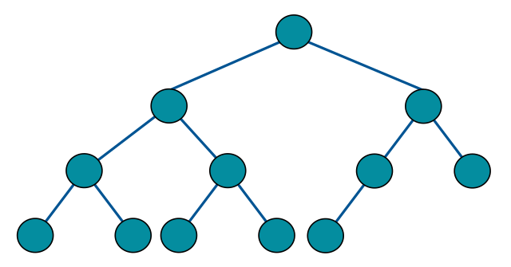
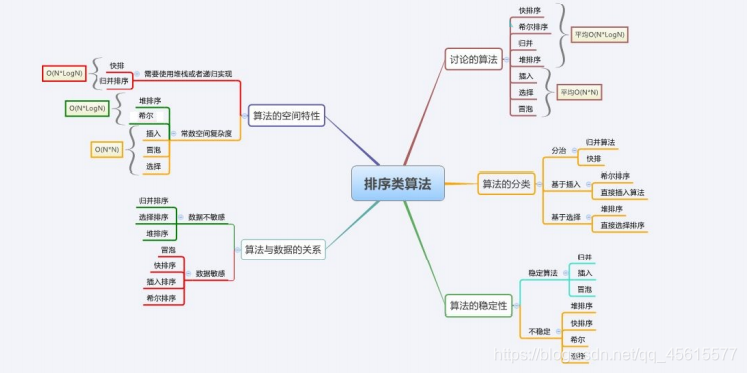

# 《数据结构与算法》


## 数据结构


### 数组

- 前缀和数组

  > 适用于快速、频繁地计算一个索引区间内的元素之和。

- 差分数组

  > 适用场景是频繁对原始数组的某个区间的元素进行增减。

- 哈希表

- 矩阵


### 链表

- 反转

- 判定环


### 栈与队列

- 优先队列：堆的应用之一


### 树


#### 遍历

前、中、后序

递归遍历，**非递归遍历**

深度遍历(DFS)，广度遍历(BFS)


#### 二叉树


##### 二叉查找树

也叫二叉搜索树，英文 BST (Binary Sort Tree)，要了解一下他们的查找，**插入**，删除

二叉查找树不保证平衡

自平衡二叉查找树：

- AVL树

- 红黑树

  > [查找（一）史上最简单清晰的红黑树讲解 - CSDN 博客](http://blog.csdn.net/yang_yulei/article/details/26066409)
  >
  > [查找（二）简单清晰的 B 树、Trie 树详解 - CSDN 博客](http://blog.csdn.net/yang_yulei/article/details/26104921)

- Treap

  Treap=Tree+Heap，树堆=树+堆

  Treap既是一棵二叉查找树，也是一个二叉堆。但是这两种数据结构貌似还是矛盾的存在，如果是二叉查找树，就不能是一个堆，如果是一个堆，那么必然不是二叉查找树。

  所以树堆用了一个很巧妙的方式解决这个问题：给每个键值一个随机附加的优先级，让键值满足二叉查找树的结构，让优先级满足二叉堆的结构。

  就像下面这个样子：（图片摘自腾讯云）

  


##### 完全二叉树

每一层都是紧凑靠左排列的




##### 满二叉树

是一种**特殊的完全二叉树**，每层都是是满的，像一个稳定的三角形


##### 哈夫曼树

Huffman Tree

带权路径长度最短的二叉树，也称为最优二叉树

哈夫曼编码


#### 多路搜索树


##### B树，B-树

B-tree树 即 B树，是一种多路搜索树

B 树的两个明显特点：

- 树内的每个节点都存储数据

- 叶子节点之间无指针相邻


##### B+树

B+树的两个明显特点

1. 数据只出现在叶子节点
2. 所有叶子节点增加了一个链指针

B+树相比 B 树的优势

1. 单一节点存储更多的元素，使得查询的 IO 次数更少；

2. 所有查询都要查找到叶子节点，查询性能稳定；

3. 所有叶子节点形成有序链表，便于范围查询。


##### B*树

是 B+树的变体，在 B+树的非根和非叶子结点再增加指向兄弟的指针


##### 2-3树 与 2-3-4树

2-3树中每一个节点都具有两个孩子（我们称它为2节点）或三个孩子（我们称它为3节点）。


##### 字典树

Trie


### 堆

本质：一个可以被看做一棵**完全二叉树**的**数组**

实现：建堆过程，堆的调整

单推问题：

> 通过一个堆就可以解决的问题
>
> 一般这种问题都具有以下特点：求解第/前 k个最大，最小或是最频繁的元素；都可以使用堆来实现 （而不用通过排序实现）

双堆问题：

> 通过两个堆相互配合解决问题
>
> 特点：
>
> 被告知，我们拿到一大把可以分成两队的数字。**怎么把数字分成两半？使得：小的数字都放在一起，大的放在另外一半**。双堆模式就能高效解决此类问题。然后通过小顶堆寻找最小数据，大顶堆寻找堆中最大数据


### 图

- 拓扑排序

- 二分图

- 并查集

- 最小生成树

  Kruskal：利用 Union-Find 并查集算法向最小生成树中添加边，配合排序的贪心思路，从而得到一棵权重之和最小的生成树。

  Prim：切分定理。

  比较：Kruskal 算法是在一开始的时候就把所有的边排序，然后从权重最小的边开始挑选属于最小生成树的边，组建最小生成树。Prim 算法是从一个起点的切分（一组横切边）开始执行类似 BFS 算法的逻辑，借助切分定理和优先级队列动态排序的特性，从这个起点「生长」出一棵最小生成树。

- 最短路径算法

  **Dijkstra 算法**

  Bellman-Ford 算法（可处理负权边）

  Floyd 算法

  SPFA 算法


### 其他

- 跳跃表
- 布隆过滤器，位图，hyperloglog
- 倒排索引


## 算法


### 时间/空间复杂度

- 算法复杂度

  - 多项式时间

    一种是 O(1),O(log(n)),O(n^a) 等，我们把它叫做多项式级的复杂度，因为它的规模 n 出现在底数的位置；另一种是 O(a^n) 和 O(n!) 型复杂度，它是非多项式级的。后者的复杂度无论如何都远远大于前者，其复杂度计算机往往不能承受。[原文](https://www.zhihu.com/question/24653072)

    这里引出几个问题：

    1. NP 问题：就是可以（多知项式时间内）短时间内验证一个答案正确性的问题。

    2. NP 完全问题：第一个条件，可以这么说，就是道你如果能解决 A 问题，则通过 A 问题可以解决 B 问题，那么回 A 问题比 B 问题复杂，当所有的问题都可以通过 A 问题的解决而解决的话，那么 A 问题就可以称为 NP 完全问题，第二个条件，就是答 A 问题属于 NP 问题。


### 排序

#### 插入排序

插入排序的三种实现：直接插入排序，二分查找插入排序，希尔排序。

##### （1）直接插入排序

- 时间复杂度：O(n^2)

  > 直接插入排序耗时的操作有：比较+后移赋值。时间复杂度如下：
  >
  > 1) 最好情况：序列是升序排列，在这种情况下，需要进行的比较操作需（n-1）次。后移赋值操作为0次。即O(n)
  >
  > 2) 最坏情况：序列是降序排列，那么此时需要进行的比较共有n(n-1)/2次。后移赋值操作是比较操作的次数加上 (n-1）次。即O(n^2)

- 空间复杂度：O(1)

- 稳定性：直接插入排序是稳定的，不会改变相同元素的相对顺序。

- 优化改进

  > 1) 二分查找插入排序：因为在一个有序区中查找一个插入位置，所以可使用二分查找，减少元素比较次数提高效率。
  >
  > 2) 希尔排序：如果序列本来就是升序或部分元素升序，那么比较+后移赋值操作次数就会减少。希尔排序正是通过分组的办法让部分元素升序再进行整个序列排序。（原因是，**当增量值很大时数据项每一趟排序需要的个数很少，但数据项的距离很长。当增量值减小时每一趟需要和动的数据增多，此时已经接近于它们排序后的最终位置。**）


##### （2）二分查找插入

直接插入排序的一个变种，区别是：在有序区中查找新元素插入位置时，为了减少元素比较次数提高效率，采用二分查找算法进行插入位置的确定。

时间复杂度 O(n^2)，稳定的


##### （3）希尔排序

思想：分治策略

希尔排序是一种分组直接插入排序方法，其原理是：先将整个序列分割成若干小的**子序列**，再分别对子序列进行直接插入排序，使得原来序列成为基本有序。这样通过对较小的序列进行插入排序，然后对基本有序的数列进行插入排序，能够提高插入排序算法的效率。

希尔排序的时间复杂度与增量的选取有关，但是现今仍然没有人能找出希尔排序的精确下界。

平均时间复杂度 O(nlog2n)，不稳定。


#### 选择排序

##### （1）简单选择排序

每一次从待排序的数据元素中选出最小（或最大）的一个元素，存放在序列的起始位置，直到全部待排序的 数据元素排完 。

找出序列中的最小关键字，然后将这个元素与序列首端元素交换位置。


##### （2）堆排序

如何建堆 和调整堆？


#### 交换排序

##### （1）冒泡

比较两个记录键值的大小，如果这两个记录键值的大小出现逆序，则交换这两个记录

缺点：慢，每次只能移动两个相邻的数据


##### （2）快排

选择基准的方式：固定位置、随机选取基准、三数取中（三种快排）

快排最好最坏的情况？优化方案？

优化方式：

优化1：当待排序序列的长度分割到一定大小后，使用插入排序

优化2：在一次分割结束后，可以把与Key相等的元素聚在一起，继续下次分割时，不用再对与key相等元素分割

优化3：优化递归操作

优化4：使用并行或多线程处理子序列（略）

（了解**三路快排、双基准**）

快排是二路划分的算法。如果待排序列中重复元素过多，也会大大影响排序的性能。这时候，如果采用三路划分，则会很好的避免这个问题。

扩展：

[算法与数据结构](https://www.cnblogs.com/deng-tao/category/951445.html)

这里给出了双路快排，三路快排，自底向上的归并排序算法等解析

附：关于他双路快排的实现：

```c++
while ((i < right) && (arr[i] < v)) i++;    // 使用索引 i 从左往右遍历直到 arr[i] < v
while ((j > left + 1) && (arr[j] > v)) j--; // 使用索引 j 从右往左遍历直到 arr[j] > v
```

个人认为还可以优化，把相等的情况考虑进去，如下：

```c++
while ((i < right) && (arr[i] <= v)) i++;    // 使用索引 i 从左往右遍历直到 arr[i] < v
while ((j > left + 1) && (arr[j] >= v)) j--; // 使用索引 j 从右往左遍历直到 arr[j] > v
```


#### 归并排序

为什么快速排序是不稳定排序，而归并排序是稳定排序呢？


#### 非比较排序算法

前述几种排序算法都属于“基于比较的排序算法”，它们通过比较元素间的大小来实现排序。此类排序算法的时间复杂度无法超越O(nlogn)。

还有几种“非比较排序算法”，它们的时间复杂度可以达到线性阶：

桶排序，计数排序，基数排序


#### 排序算法比较

时间、空间、稳定性比较




选择排序和冒泡排序的区别

> 选择排序每次从未排序的部分选取最小（或最大）的元素，然后与未排序部分的第一个元素交换位置，这样逐步形成有序序列。
>
> 冒泡排序则是依次比较相邻的元素，如果顺序不对就交换它们的位置，这样逐步将最大（或最小）的元素“冒泡”到末尾。
>
> 总体而言，选择排序在每一轮中找到最小元素只进行一次交换，而冒泡排序可能需要多次交换。因此，选择排序通常在实际应用中略优于冒泡排序。


#### Java 中是排序算法

`Colletions.sort`和`Arrays.sort`分别用了什么排序算法呢


### 查找

* 二分查找

  选取mid时，(r + l) / 2 这里的加法可能回产生整型溢出，

  解决办法：l + (r - l) / 2

* 索引，倒排索引

* 双指针

* KPM 算法

  - [阮一峰 字符串匹配的 KMP 算法](http://www.ruanyifeng.com/blog/2013/05/Knuth%E2%80%93Morris%E2%80%93Pratt_algorithm.html)

    补充：这篇博客的数组并不是 next 数组，而是"部分匹配值"数组，就是"前缀"和"后缀"的最长的共有元素的长度

  - [CSDN KMP 算法—终于全部弄懂了](https://blog.csdn.net/dark_cy/article/details/88698736)

    该博客分析了`k = next[k]`的问题

  - [kpm 算法 - u012361418 的博客 - CSDN 博客](http://blog.csdn.net/u012361418/article/details/46125439)

  - [KMP 算法及优化 - 疯狂的爱因斯坦 - SegmentFault](https://segmentfault.com/a/1190000007066358#articleHeader4)

    该博客讲解了 KPM 的优化问题


### 五大常用算法

贪婪（贪心）算法，动态规划算法，分治算法，回溯算法以及分支限界算法


### 贪心

基本思想：在对问题求解时，总是做出在当前看来是最好的选择（不从整体最优上考虑，只做出在某种意义上的局部最优解）。

它省去了为找最优解要穷尽所有可能而必须耗费的大量时间，它采用自顶向下，以迭代的方法做出相继的贪心选择，每做一次贪心选择就将所求问题简化为一个规模更小的子问题，通过每一步贪心选择，可得到问题的一个最优解，虽然每一步上都要保证能获得局部最优解，但由此产生的全局解有时不一定是最优的，所以贪心算法不要回溯。


### 动态规划

基本思想：将待求解的问题分解成若干子问题，先求解子问题，然后从这些子问题中得到原问题的解。用分治法不同的是，适用于动态规划法求解的问题，经分解得到**子问题往往不是互相独立**的（即下一个子阶段的求解是建立在上一个子阶段的解的基础上，进行进一步的求解）。

特征：

（1）最优子结构：最优子结构性质是指问题的最优解包含其子问题的最优解。

（2）子问题重叠：子问题重叠是指在求解子问题的过程中，有大量的子问题是重复的。

（3）无后效性：当前阶段的求解只和前面阶段有关，和后续阶段无关，称为“无后效性”。

**三要素：**

状态转移方程、最优子结构、最优子结构

常见问题：

[常见动态规划问题总结](https://blog.csdn.net/mc695192383/article/details/70146579)

[最长公共子序列与最长公共子串 (DP)](https://blog.csdn.net/u012102306/article/details/53184446)

  1. **最长递增子序列**

     **解法 1：最长公共子序列法**

     **解法 2：动态规划法（时间复杂度 O(N^2))**

     dp[i] 表示以标识为 i 的元素为递增序列结尾元素的最长递增子序列的长度

     **解法 3：O(NlgN）算法**

     b[i] 只是存储的对应长度为 i 的 LIS 的最小末尾

  2. **最长公共子序列**

     用 dp[i][j] 来表示 A 串中的前 i 个字符与 B 串中的前 j 个字符的最长公共子序列长度

  3. **最长公共子串**

     这个问题与上面的问题类似，区别点在于这里是子串，是连续的，令 dp[i][j] 表示 A 串中的以第 i - 1 个字符与 B 串中的以第 j - 1 个字符结尾的最长公共子串的长度

  4. **最小编辑代价问题**

     首先令 dp[i][j] 表示将 A 串中的前 i 个字符转换成 B 串中的前 j 个字符所需要的代价

**0-1背包问题**


### 分治

基本思想：与动态规划法类似，将待求解的问题分解成若干子问题，求出子问题的解，合并之后即为原问题的解。不同的是：这些**子问题是相互独立的，且与原问题的性质相同。**（可用分治法解决的问题常常采用递归的形式求解）。

解题步骤：

（1）分解：将要解决的问题分解为若干个规模较小、相互独立、与原问题形式相同的子问题。

（2）治理：求解各个子问题，由于各个子问题与原问题形式相同，只是规模较小而已，而当子问题规划的足够小时，就可以用较简单的方法解决。

（3）合并：按照原问题的要求，将子问题的解合并为原问题的解。

常见问题：

二分搜索

[分治法的经典问题——大整数相乘](https://www.cnblogs.com/little-kwy/archive/2017/09/30/7613642.html)

归并派系

快速排序


### 回溯

基本思想：回溯法是一种选优搜索法，按选优条件向前搜索，以达到目标。当搜索到某一步时发现不满足条件，即进行回溯（退回上一步重新进行选择），直到搜索完整个空间。

[简单易懂的回溯算法（Back Tracking) - cometwo的个人空间 - OSCHINA - 中文开源技术交流社区](https://my.oschina.net/u/3024426/blog/4689026)

**深度优先搜索算法**

**八皇后问题**


### 分支限界法

基本思想：求解目标为找出满足约束条件的一个解，或是在满足约束条件的解中找出在某种意义下的最优解，**常使用广度优先搜索算法**。

常用的两种分支限界法：

（1）队列式分支限界法

（2）优先队列式分支限界法

FIFO搜索，LIFO搜索


### 思想

**递归**

斐波那契数列，其时间复杂度和空间复杂度


**递推**

动态规划就是递推的思想

[算法洗脑系列（8 篇）——第一篇 递推思想 - 一线码农 - 博客园](http://www.cnblogs.com/huangxincheng/archive/2011/12/29/2305525.html)


**启发式算法**

- 遗传算法（GA）

- A* 算法（可拓展了解下 Navmesh）


## 算法题


### 经典题目

* 经典问题之字符串

* Top K 问题

* [面试必备 | 不可不会的反转链表](https://mp.weixin.qq.com/s/_DJgsdhY4drJyEPN9xZX6Q)

* [最大公共子串](https://mp.weixin.qq.com/s/Yx3uRVGFYikx8gm-oi-0vg)

* [看一遍就理解：动态规划详解](https://mp.weixin.qq.com/s/1dG8Dk7nZeIGHQ0Hp8gq7Q)

  青蛙跳阶问题：递归时的重复计算问题

  递增子序列：看一下解题思路：穷举分析，确定边界，找规律，确定状态转移方程


### 有意思的题目

* 摩尔投票法

  [面试题 17.10. 主要元素](https://leetcode-cn.com/problems/find-majority-element-lcci/)

  [求众数 II](https://leetcode-cn.com/problems/majority-element-ii/solution/qiu-zhong-shu-ii-by-leetcode-solution-y1rn/)

- GCD，它通常表示最大公约数（greatest common divisor）

  欧几里德算法又称辗转相除法，是指用于计算两个正整数a，b的最大公约数。应用领域有数学和计算机两个方面。计算公式gcd(a,b) = gcd(b,a mod b)。


### 海量数据处理

- [advanced-java/docs/big-data](https://github.com/doocs/advanced-java/tree/main/docs/big-data)


## 链接


### 参考链接

[Hello 算法 (hello-algo.com)](https://www.hello-algo.com/)

[labuladong 的算法笔记 | labuladong 的算法笔记](https://labuladong.online/algo/)


### 练习平台

- CS-Notes
  - [剑指 Offer](https://github.com/CyC2018/CS-Notes/blob/master/notes/%E5%89%91%E6%8C%87%20Offer%20%E9%A2%98%E8%A7%A3%20-%20%E7%9B%AE%E5%BD%95.md)
  - [LeetCode](https://github.com/CyC2018/CS-Notes/blob/master/notes/Leetcode%20%E9%A2%98%E8%A7%A3%20-%20%E7%9B%AE%E5%BD%95.md)
- [牛客笔试面试题库](https://www.nowcoder.com/contestRoom?from=cyc_github)


### 书单

- 《漫画算法：小灰的算法之旅》
- 《 算法导论 》
- 《 算法 ( 第4版 )  》
